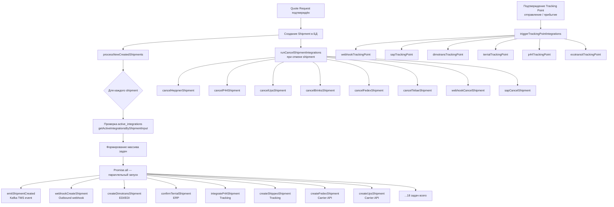
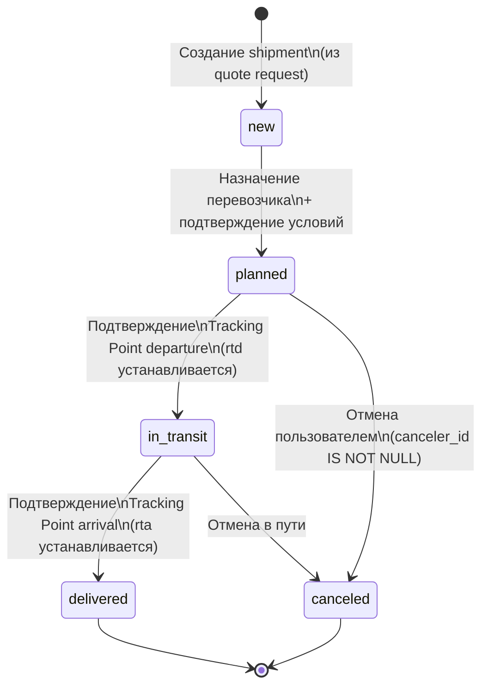

# Поведение интеграций при работе с отправлениями

## 1. Поток запуска интеграций

### Общая схема

При создании отправления из подтверждённого запроса котировки вызывается функция `processNewCreatedShipments()`. Она собирает плоский массив задач (по одному набору на каждое отправление) и запускает их параллельно через `Promise.all`. Все задачи выполняются по принципу «запустил и забыл» — сбои подавляются и не прерывают основной поток.

Функция вызывается из трёх мест:

- `app/services/shipments.js:2351` — после создания отправления из quote request
- `app/services/quote_requests.js:2819` — при подтверждении запроса котировки
- `app/services/shipment_brothers.js:304` — при создании дочерних отправлений (brothers)



### Полный список задач при создании отправления

| # | Функция | Интеграция |
|---|---|---|
| 1 | `emitShipmentCreated` | Kafka TMS event |
| 2 | `uploadShipmentTransportOrder` | Генерация/загрузка транспортного ордера |
| 3 | `generateTeliaeBillOfLading` | Teliae BoL |
| 4 | `webhookCreateShipment` | Исходящий webhook |
| 5 | `webhookCreateVisitByShipmentIds` | Webhook на создание визита |
| 6 | `webhookFreightUnitCreateShipment` | Webhook на freight unit |
| 7 | `createDimotransShipment` | Dimotrans |
| 8 | `confirmTerrialShipment` | Terrial |
| 9 | `buildAndUploadTeliaeDisporMessage` | Teliae DISPO |
| 10 | `buildAndUploadIftminD96AMessage` | Teliway IFTMIN D96A |
| 11 | `createShippeoShipment` | Shippeo (visibility) |
| 12 | `integrateP44Shipment` | Project44 (visibility) |
| 13 | `buildAndUploadEcotransitMessage` | Ecotransit |
| 14 | `buildAndUploadCalvacomDisporMessage` | Calvacom/XPO DISPO |
| 15 | `createBrinksShipment` | Brinks |
| 16 | `createFedexShipment` | FedEx API |
| 17 | `createUpsShipment` | UPS |
| 18 | `createLivingPacketsShipment` | Living Packets |
| 19 | `sendReflexShipmentData` | Reflex/WMS |
| 20 | `postProcessSlotByShipmentId` | Slot processing |
| 21 | `registerDachserShipment` | Dachser |

---

## 2. Таблица `active_integrations`

### Назначение

`active_integrations` — центральная таблица активации интеграций. Каждая запись означает: «данная интеграция активна для конкретной пары шиппер–перевозчик». Сам тип интеграции хранится не в этой таблице, а в связанной записи `integration_settings` (поле `integration_name`).

### Все поля таблицы

| Поле | Тип | Описание |
|---|---|---|
| `id` | INTEGER | Первичный ключ, автоинкремент |
| `integration_setting_id` | INTEGER | FK → `integration_settings.id` — ссылка на конкретный тип интеграции |
| `shipper_id` | INTEGER, nullable | FK → `shippers.id` — ограничение по шипперу |
| `carrier_id` | INTEGER, nullable | FK → `carriers.id` — ограничение по перевозчику |
| `address_id` | INTEGER, nullable | FK → `addresses.id` — ограничение по адресу |
| `shipper_code` | STRING, nullable | Код аккаунта шиппера у перевозчика |
| `carrier_code` | STRING, nullable | Код перевозчика |
| `carrier_product_code` | STRING, nullable | Код продукта/сервиса перевозчика |
| `accounting_entity_id` | INTEGER, nullable | FK → `accounting_entity.id` — бухгалтерская сущность |
| `parameters` | JSONB, default `{}` | Кастомные параметры активации. Примеры ключей: `userId`, `dhlFcaPayerAccountNumber`, `suppressAutoNotifications`, `triggerDocumentRetrieval` |
| `transit_company_id` | INTEGER, nullable | FK → `dict_transit_companies.id` |
| `created_at` | DATE | Дата создания |
| `updated_at` | DATE | Дата обновления |
| `deleted_at` | DATE, nullable | Дата soft-delete (paranoid: true) |

### Как активировать интеграцию для пары шиппер–перевозчик

1. В Admin-App перейти в раздел **Integrations → Active Integrations**
2. Нажать **Создать** (`POST /api/v1/active-integrations`)
3. Выбрать тип интеграции (`integration_setting_id`)
4. Указать `shipper_id` и/или `carrier_id` — область применения
5. Заполнить `shipper_code`, `carrier_code` и `parameters` согласно требованиям конкретной интеграции
6. Перед сохранением выполнить проверку дублей (`POST /api/v1/active-integrations/check-duplicates`)

Деактивация: `DELETE /api/v1/active-integrations/:id` (soft-delete, запись помечается `deleted_at`).

---

## 3. Типы интеграций и их поведение при работе с отправлениями

### Полный список директорий и enum-значений

| Директория | INTEGRATION_TYPES ключ | String-значение |
|---|---|---|
| `aftership` | `AFTERSHIP` | `aftership` |
| `brinks` | `BRINKS` | `brinks` |
| `calvacom` | — | — |
| `dachser` | `DACHSER` | `dachser` |
| `db-schenker` | `DB_SCHENKER` | `db_schenker` |
| `dhl-global-forwarding` | `DHL_GLOBAL_FORWARDING` | `dhl_global_forwarding` |
| `dimotrans` | — | — |
| `ecotransit` | `ECOTRANSIT` | `ecotransit` |
| `fedex` | — | — |
| `fedex-api` | `FEDEX_API` | `fedex-api` |
| `heppner` | `HPR` | `heppner` |
| `hubspot` | — | — |
| `inttra` | — | — |
| `kuehne-nagel` | `KN` | `kuehne-nagel` |
| `livingpacket` | `LIVING_PACKETS` | `living-packets` |
| `marine-traffic` | `MARINE_TRAFFIC` | `marine_traffic_kpler` |
| `mydhl` | `MY_DHL` | `mydhl` |
| `p44` | `P44` | `p44` |
| `peripass` | `PERIPASS` | `peripass` |
| `reflex` | `REFLEX` | `reflex` |
| `sap` | `SAP` | `sap` |
| `shippeo` | `SHIPPEO` | `shippeo` |
| `teliae` | `TELIAE` | `teliae` |
| `teliway` | — (использует `TELIWAY_*` в EDIFACT env) | — |
| `terrial` | — | — |
| `ups` | `UPS` | `ups` |

Дополнительные enum-записи без отдельной директории: `DHL` (`dhl`), `DHL_FCA` (`dhl-fca`), `DHL_INOVERT` (`dhl_inovert`), `TELIAE_FEDEX` (`teliae-fedex`).

---

### DHL (MyDHL / DHL FCA / DHL Global Forwarding)

**Что происходит при создании отправления:**
- `createFedexShipment` — вызов carrier API для создания записи об отправке (отдельная функция, несмотря на название)
- DHL FCA: генерация этикетки (label) и возврат трек-номера
- MyDHL: создание shipment через DHL Express API, получение AWB (Air Waybill)
- DHL GFW: интеграция на уровне booking, а не отдельного shipment — обходит стандартный `getActiveIntegrationsByShipmentInput` (входит в skip list)

**Трекинг:**
- Обновления статусов через polling или webhook от DHL
- Трек-номер сохраняется в `shipments.tracking_code`

**Особенность:** `dhl_global_forwarding` и `mydhl` исключены из стандартного lookup по shipment и обрабатываются отдельными прямыми вызовами.

---

### Heppner (HPR)

**Поток бронирования:**

```
createHeppnerRequest
  → отправка данных об отправлении в API Heppner
  → получение номера бронирования (HPR reference)
  → сохранение reference в метаданных shipment

При доставке:
  → Heppner присылает POD (Proof of Delivery)
  → POD привязывается к shipment
  → pod_status: pending → loaded → approved/declined
```

**При отмене:** `cancelHeppnerShipment` — уведомление Heppner об отмене.

---

### P44 / Project44 (видимость и трекинг)

**Что происходит при создании:**
- `integrateP44Shipment` — регистрация shipment в платформе Project44
- P44 получает данные о маршруте и начинает отслеживание

**Автоматические Tracking Points:**
- P44 возвращает GPS-события через webhook или polling
- Система автоматически создаёт TP (tracking points) на основе данных P44
- Departure event → `rtd` устанавливается, статус → `in_transit`
- Arrival event → `rta` устанавливается, статус → `delivered`

**При подтверждении TP:** `p44TrackingPoint` — отправка статуса обратно в P44 (двусторонняя синхронизация).

**При отмене:** `cancelP44Shipment`.

---

### Shippeo (видимость и трекинг)

**Что происходит при создании:**
- `createShippeoShipment` — регистрация в Shippeo TMS
- Shippeo подключает GPS-трекер водителя через мобильное приложение

**Автоматические Tracking Points:**
- Аналогично P44 — GPS-данные от Shippeo создают TP автоматически
- ETA рассчитывается на основе GPS + алгоритм Shippeo

**Отличие от P44:** Shippeo ориентирован на road transport и коммуникацию с водителем; P44 поддерживает мультимодальные перевозки.

---

### SAP (ERP-интеграция)

**Синхронизация транспортного плана:**
- При создании shipment → `sapCreateShipment` отправляет транспортный план в SAP
- SAP создаёт соответствующий транспортный заказ

**При подтверждении Tracking Point:**
- `sapTrackingPoint` — отправка фактических дат отправления/прибытия в SAP
- SAP обновляет статус транспортного заказа

**Экспорт инвойсов:**
- SAP инициирует создание инвойсов на основе выполненных отправлений
- Маппинг адресов настраивается через Admin-App: `SAP → Address Mappings`

**При отмене:** `sapCancelShipment` — аннулирование транспортного заказа в SAP.

**Конфигурация:** `INTEGRATION_TYPES.SAP` = `sap`. Маппинг SAP agency-ключей на адреса шипперов: `POST /api/v1/sap/address-mappings`.

---

### AfterShip (трекинг посылок)

**Принцип работы:**
- AfterShip — агрегатор трекинга для парселей (couriers: DHL, FedEx, UPS и др.)
- При наличии трек-номера (`tracking_code`) AfterShip подписывается на обновления

**Webhook-поток:**
- AfterShip присылает статус-апдейты на входящий webhook Shiptify
- Каждый апдейт создаёт Tracking Point в системе
- Финальный статус `delivered` обновляет `shipments.pod_status` и `rta`

**Использование:** подходит для мультиперевозчикового трекинга парселей без прямой интеграции с каждым перевозчиком.

---

### Reflex / WMS

**Назначение:** Интеграция с WMS (Warehouse Management System) Reflex.

**При создании отправления:**
- `sendReflexShipmentData` — отправка данных об отправлении в Reflex WMS

**Двусторонний поток:**
- Shiptify → Reflex: данные о создании/изменении shipment
- Reflex → Shiptify: статус обработки на складе

**UI-кнопка WMS (вкладка Tracking):**
- При активной интеграции Reflex на странице отправления появляется кнопка **WMS**
- Нажатие открывает соответствующую запись в интерфейсе Reflex WMS
- Кнопка отображается только если для shipment активна интеграция `REFLEX`

**Outbound webhook:** все изменения статуса shipment также продублированы через исходящий webhook (независимо от Reflex).

---

### Интеграции, исключённые из стандартного lookup

Следующие интеграции **обходят** стандартный `getActiveIntegrationsByShipmentInput` и обрабатываются отдельными прямыми вызовами:

| Интеграция | Причина исключения |
|---|---|
| `peripass` | Работает на уровне визитов (visits), не отправлений |
| `dhl_global_forwarding` | Работает на уровне booking |
| `mydhl` | Выделенный прямой вызов |
| `fedex-api` | Выделенный прямой вызов |
| `ups` | Выделенный прямой вызов |
| `teliae` | Выделенный прямой вызов |
| `living-packets` | Выделенный прямой вызов |
| `brinks` | Выделенный прямой вызов |

---

## 4. UI-индикаторы интеграций

### Красный баннер — ошибка интеграции

Отображается на странице отправления, если один или несколько вызовов к внешнему API завершились с ошибкой.

- Источник: записи в `integration_logs` со статусом ошибки для данного shipment
- Содержит: название интеграции, код ошибки, краткое описание
- Действие: ссылка на Integration Logs в Admin-App для детального разбора

### Синий баннер — информационное сообщение

Отображается при наличии некритичных уведомлений от интеграций.

- Пример: интеграция активна, но ожидает подтверждения от перевозчика
- Пример: трекинг-номер ещё не присвоен
- Действие не требуется, но полезно для контекста

### Ссылка Marine Traffic

При наличии морского отправления (`mode` = sea/ocean) и активной интеграции `MARINE_TRAFFIC`:
- На вкладке отправления отображается ссылка **Marine Traffic**
- Ссылка ведёт на страницу судна/контейнера на marinetraffic.com / Kpler
- `INTEGRATION_TYPES.MARINE_TRAFFIC` = `marine_traffic_kpler`

### Кнопка WMS (вкладка Tracking)

- Отображается только при активной интеграции `REFLEX` для данного shipment
- Открывает соответствующую запись в Reflex WMS
- Цель: быстрый переход из Shiptify в WMS без ручного поиска

---

## 5. Поля модели Shipment (таблица `shipments`)

Таблица поддерживает paranoid soft-delete (поле `deleted_at`).

| Поле | Тип | Описание |
|---|---|---|
| `id` | INTEGER | Первичный ключ, автоинкремент |
| `account_id` | INTEGER, nullable | Аккаунт |
| `shipper_id` | INTEGER, nullable | Шиппер |
| `driver_id` | INTEGER, nullable | Водитель |
| `shipper_division_id` | INTEGER, not null | Подразделение шиппера |
| `carrier_id` | INTEGER, nullable | Перевозчик |
| `carrier_division_id` | INTEGER, not null | Подразделение перевозчика |
| `code` | STRING, nullable | Внешний код отправления |
| `from_address_id` | INTEGER, nullable | Адрес отправления |
| `dest_address_id` | INTEGER, nullable | Адрес назначения |
| `status` | STRING, nullable | Статус: `new`, `planned`, `in_transit`, `delivered`, `canceled` |
| `mode` | STRING, nullable | Режим перевозки (road, sea, air и др.) |
| `shipment_mode_id` | INTEGER, nullable | FK на справочник режимов |
| `tracking_code` | STRING, nullable | Трек-номер перевозчика |
| `name` | STRING, nullable | Псевдоним отправления (nickname) |
| `internal_ref` | STRING, nullable | Внутренняя ссылка |
| `weight` | DECIMAL(10,3), default 0.0 | Вес |
| `cost` | DECIMAL(10,3), default 0.0 | Стоимость перевозки |
| `cost_commercial` | DECIMAL(10,3), default 0.0 | Коммерческая стоимость |
| `goods_value` | DECIMAL(10,3), default 0.0 | Ценность груза |
| `date` | DATE, nullable | Дата отправления (план) |
| `etd` | DATE | Расчётное время отправления |
| `etd_max` | DATE | Максимальное ETD (для окна) |
| `eta` | DATE | Расчётное время прибытия |
| `eta_max` | DATE | Максимальное ETA (для окна) |
| `rtd` | DATE | Фактическое время отправления (устанавливается при подтверждении TP departure) |
| `rta` | DATE | Фактическое время прибытия (устанавливается при подтверждении TP arrival) |
| `date_lock` | JSONB, nullable | Блокировки дат |
| `shipper_is_read` | BOOLEAN, default false | Прочитано шиппером |
| `carrier_is_read` | BOOLEAN, default false | Прочитано перевозчиком |
| `in_out` | STRING(10), nullable | Направление: inbound / outbound |
| `carrier_service` | STRING(30), nullable | Сервис перевозчика |
| `quote_request_id` | INTEGER, nullable | FK → quote_requests |
| `sh_request_id` | INTEGER, nullable | FK → transport requests |
| `is_trackable` | BOOLEAN, default false | Доступен ли трекинг |
| `archived_shipper` | BOOLEAN, default false | Архивировано шиппером |
| `archived_carrier` | BOOLEAN, default false | Архивировано перевозчиком |
| `arrival_date_real` | DATE, nullable | Фактическая дата прибытия (устаревшее поле, заменено `rta`) |
| `canceler_id` | INTEGER, nullable | ID пользователя, отменившего отправление. IS NOT NULL = состояние отменено |
| `is_multicontainer` | BOOLEAN, default false | Мультиконтейнерное отправление |
| `container_name` | STRING, nullable | Имя/номер контейнера |
| `is_full_day_departure` | BOOLEAN, default false | Отправление на весь день (без конкретного времени) |
| `is_full_day_arrival` | BOOLEAN, default false | Прибытие на весь день |
| `is_total_volume` | BOOLEAN, default false | Использовать суммарный объём |
| `is_total_weight` | BOOLEAN, default false | Использовать суммарный вес |
| `total_volume` | DOUBLE, default 0.0 | Суммарный объём (м³) |
| `total_weight` | DOUBLE, default 0.0 | Суммарный вес (кг) |
| `total_linear_meters` | DOUBLE, default 0.0 | Суммарные погонные метры |
| `is_content_updated` | BOOLEAN, default false | Контент отправления изменён после создания |
| `is_pick_up_expected` | BOOLEAN, default false | Ожидается самовывоз. Флаг односторонний — сброса нет |
| `is_delivery_expected` | BOOLEAN, default false | Ожидается доставка. Флаг односторонний — сброса нет |
| `from_zone_id` | INTEGER, nullable | Зона отправления |
| `dest_zone_id` | INTEGER, nullable | Зона назначения |
| `pre_shipment_id` | INTEGER, nullable | Предшествующее отправление (цепочка) |
| `co2_amount` | DOUBLE, nullable | Расчётный выброс CO₂ (кг) |
| `distance` | DOUBLE, nullable | Расстояние маршрута (км) |
| `available_for_grouping` | BOOLEAN, default true | Доступно для группировки в consolidated shipments |
| `from_dock_door_id` | INTEGER, nullable | Ворота погрузки |
| `dest_dock_door_id` | INTEGER, nullable | Ворота разгрузки |
| `currency_code` | STRING(3), default `EUR` | Валюта стоимости |
| `workload` | INTEGER, nullable | Трудоёмкость (для планирования) |
| `pod_status` | STRING, default `pending` | Статус подтверждения доставки: `pending`, `loaded`, `approved`, `declined` |
| `accounting_entity_id` | INTEGER, nullable | FK → accounting_entities |
| `external_container_id` | STRING, nullable | Внешний ID контейнера |
| `booker_email` | STRING, nullable | Email заказчика (валидируется как email) |
| `integration_source` | ENUM(`dhl-fca`), nullable | Источник создания через интеграцию |
| `bl_id` | STRING, nullable | Bill of Lading ID |
| `cmr_details` | JSONB, nullable | Детали CMR (транспортная накладная) |
| `cancellation_data` | JSONB, nullable | Данные об отмене: `{ comment, reason, date }` |
| `created_at` | DATE | Дата создания |
| `updated_at` | DATE | Дата обновления |
| `deleted_at` | DATE, nullable | Дата soft-delete |

---

## 6. Переходы статусов (State Machine)

### Статусы отправления



### Подробности переходов

| Переход | Триггер | Что происходит |
|---|---|---|
| `new` | Создание через `processNewCreatedShipments` | Все 21 интеграция-задача запускаются параллельно |
| `new → planned` | Перевозчик подтверждает условия | Уведомление шипперу, обновление шипперу `shipper_is_read = false` |
| `planned → in_transit` | Пользователь подтверждает TP departure | `rtd` = фактическая дата, `status = in_transit`. Запуск: webhook, SAP, Dimotrans, Terrial, P44, Ecotransit |
| `in_transit → delivered` | Пользователь подтверждает TP arrival | `rta` = фактическая дата, `status = delivered`. Запуск тех же интеграций TP-триггеров. `pod_status` остаётся `pending` до загрузки POD |
| `* → canceled` | Явная отмена | `canceler_id` IS NOT NULL, `cancellation_data` заполняется. `runCancelShipmentIntegrations`: Heppner, P44, UPS, Brinks, FedEx, Teliae, webhook, SAP |

### POD (Proof of Delivery)

После статуса `delivered` начинается процесс подтверждения доставки:

```
pod_status: pending
  → loaded   : Документ POD загружен перевозчиком
  → approved : Шиппер одобрил POD
  → declined : Шиппер отклонил POD (спор)
```

`pod_status` хранится отдельно от `status` отправления и не влияет на основной state machine.
