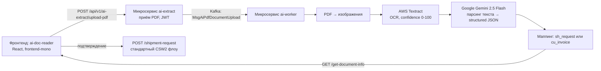

# AI Reader / Dual Screen

Функция для создания Shipment Request (CSW) из загруженного документа (пакинг-лист, накладная, customs invoice) с автоматическим извлечением полей.

Исходный документ продукта: `workspaces/documentation/product/tms/shipments/ai-reader-dual-screen.md`

> ✅ **Статус (проверено по коду 2026-06-11): реализовано и работает.** Доступ управляется ACL-правом `ai_doc_reader` (включается per-account, без ограничения по роли Shipper/Carrier). Детали аудита: [OPEN-QUESTIONS.md](../OPEN-QUESTIONS.md), раздел 1.

---

## Реальная архитектура (по коду)

Три компонента вместо «Textract в бэкенде» из слайдов:



| Компонент | Где | Роль |
|---|---|---|
| `ai-doc-reader` | `frontend-mono/packages/ai-doc-reader` (React) | Двухпанельный UI; кнопка входа встроена в Angular CSW (`ng-if="accessAIDocReader"`) |
| `ai-extract` | `microservices/node/ai-extract` | REST API загрузки/выдачи (`/api/v1/ai-extract`), JWT, метаданные в PostgreSQL |
| `ai-worker` | `microservices/node/ai-worker` | Обработка: Textract OCR → **Gemini 2.5 Flash** (основной LLM-парсер) |

**Важно:** парсит извлечённый текст **Google Gemini 2.5 Flash** (`ai-worker/src/pdfProcessor/lib/google/gemini.ts`). Код AWS Bedrock (Claude 3.5 Sonnet) существует (`lib/aws/bedrock.ts`), но **не используется** — заменён на Gemini.

Поддерживаемые типы документов: `sh_request` (Shipment Request) и `cu_invoice` (Customs Invoice).

---

## Концепция интерфейса

Двухпанельный экран:

- **Левая панель** — просмотр загруженного документа с подсветкой распознанных фрагментов.
- **Правая панель** — форма создания CSW (Create Shipment Wizard) с автозаполненными значениями.

Пользователь может исправить любое поле перед отправкой. После подтверждения создаётся стандартный Shipment Request через `POST /shipment-request` или `POST /shipment`.

---

## Поддерживаемые поля

| Поле CSW | Описание |
|---|---|
| FROM | Адрес отправителя |
| TO | Адрес получателя |
| DATE | Дата отгрузки |
| Transport mode | Вид транспорта |
| Packing List | Список товаров / упаковок |
| Comments | Комментарии / примечания |

---

## Confidence: дизайн vs код

Дизайн-концепция из слайдов — цветовое кодирование уровня уверенности (зелёный/жёлтый/красный/серый).

**По коду:** Textract confidence (число 0–100) передаётся на фронтенд **как есть** — пороговых значений low/medium/high в коде нет, фильтрации по confidence нет. Подсветка (если есть) — на усмотрение фронтенда без фиксированных порогов.

---

## Разрешение адресов (Address Resolution)

Слайды описывали цепочку `PML DB → Address Book → Google Maps → Manual`.

**По коду** (`ai-worker/src/app/convert-csw-data.ts`) реализовано проще:

```
1. Поиск в PML central DB (dbLoadAddressDataEnriched)
2. Если не найден — создание нового адреса (dbCreateAddressDataEnriched)
```

**Google Maps API не используется** — ни вызовов, ни ключей в коде нет.

---

## Связь документа с SR

Слайды: «документ автоматически прикрепляется к SR как private».

**По коду:** документ **не прикрепляется** как attachment. Сохраняется только связь в метаданных ai-extract: `POST /document-used` пишет `used_for: {type: 'sr', id}` в JSONB-метаданные загрузки. Физический файл остаётся в хранилище ai-extract.

---

## Доступ (ACL)

- Право: `ai_doc_reader` (проверка `hasAccess('ai_doc_reader')` в `mfe-shell/globalProvider.ts`)
- **Не привязано к роли** — может быть выдано и Shipper-, и Carrier-аккаунту
- Без права компонент не рендерится (`return null`)

---

## Ограничения

- Форматы: PDF (конвертируется в изображения для OCR).
- Качество распознавания зависит от качества скана.
- Для нестандартных форматов документов возможны ошибки в структуре Packing List.

---

## Связанные документы

- [external-services.md](../external-services.md) — Textract, Gemini, Bedrock
- [OPEN-QUESTIONS.md](../OPEN-QUESTIONS.md) — аудит по коду, раздел 1

---

## 🔗 Граф-метаданные
- **id:** `ai.features.ai-reader`
- **type:** module-doc · **domain:** AI · **status:** implemented
- **confluence:** 632389633 · **repo:** `ai/features/ai-reader.md`
- **code_refs:** TODO (заполнить при углублении)
- **modules:** AI
- **references:** —
- **requirements:** см. чеклисты/RTM (source backfill — волна 7.2)

