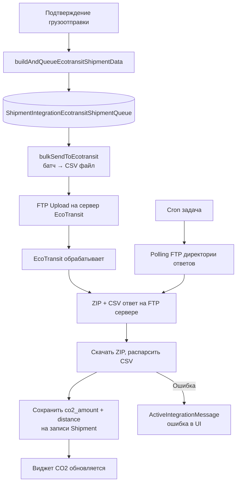

# CO2 / EcoTransit — расчёт углеродного следа

Виджет и интеграция для отображения и расчёта углеродного следа грузоотправок. Использует EcoTransit как основной расчётный движок.

Исходный документ продукта: `workspaces/documentation/product/tms/features/co2-widget.md`
Jira: TMS-2922

> ⚠️ **СТАТУС ПО КОДУ (2026-06-11):** реализована только batch-интеграция **EcoTransit SFTP** (раздел «Интеграция EcoTransit» ниже — актуален). Multi-source виджет (DHL API, Manual Entry с выбором источника, Average, разбивка NOx/SOx) — **дизайн, не реализован**: в БД нет поля источника, значение `co2_amount` перезаписывается. Ручной ввод CO2 — только **Carrier** через Public API `POST /shipments/co2` (`requireCarrier`, проверка `carrier_id` — `public-api/.../shipments.js:1163`). Пересчёта при смене перевозчика нет (hooks отсутствуют).

---

## Виджет CO2 на грузоотправке

Виджет отображает:

- **CO2e** — в килограммах, по методологии **WTW** (Well-to-Wheel) или **TTW** (Tank-to-Wheel)
- **Дистанция** — в километрах
- Разбивку по источникам данных

### Источники данных (дизайн — не реализовано)

По дизайну поддерживается несколько источников одновременно; при наличии нескольких отображается **усреднённое значение** (алгоритм усреднения не определён — в коде функции нет).

| Источник | Описание |
|---|---|
| EcoTransit | Основной расчётный движок (FTP batch API) |
| DHL API | CO2 данные от DHL |
| Manual Entry | Ручной ввод (дистанция км + CO2e WTW) |
| EcoTransit Benchmark | Бенчмарк-данные от EcoTransit |

### Разбивка по загрязняющим веществам

Для каждого источника отображаются:

| Показатель | Описание |
|---|---|
| CO2e | Эквивалент CO2 (кг) |
| NOx | Оксиды азота |
| SOx | Оксиды серы |
| NMHC | Не-метановые углеводороды |
| PM | Взвешенные частицы |

### Ошибки источников

Если источник недоступен или вернул ошибку, он отображается с **красным бейджем**. При раскрытии показывается HTTP error log.

---

## Ручной override

Пользователь может вручную переопределить данные CO2. Обязательные поля для ручного ввода:

- Дистанция (км)
- CO2e WTW (кг)

---

## Интеграция EcoTransit (технические детали)

EcoTransit — специализированный сервис расчёта транспортных эмиссий. Обмен данными через **FTP + CSV batch**.

Ключевые файлы бэкенда:
- `workspaces/backend/app/services/integration/ecotransit/impl.js` — основная логика
- `workspaces/backend/app/services/integration/ecotransit/dataBuilder.js` — построение CSV-строк
- `workspaces/backend/app/services/integration/ecotransit/constants.js` — коды режимов, единицы
- `workspaces/backend/app/services/integration/ecotransit/ftpProvider.js` — FTP-клиент
- `workspaces/backend/app/services/integration/ecotransit/tasks.js` — cron-задачи

### Схема потока данных



### Формат данных отправки

CSV-строка содержит:

| Поле | Описание | Пример |
|---|---|---|
| `shipment_id` | ID отправки с префиксом `STY_` | `STY_12345` |
| `freight_weight` | Вес груза | `1500` |
| `main_transport_mode` | Вид транспорта | `Road`, `Air`, `Sea`, `Ro-Ro` |
| `weight_unit` | Единица веса | `kg` |
| Координаты / коды | Зависят от режима транспорта | см. ниже |

### Формат локаций по видам транспорта

| Вид транспорта | Формат локации |
|---|---|
| Air | IATA код аэропорта |
| Sea / Ro-Ro | UN/LOCODE порта |
| Road / Express | Почтовый индекс или геокоординаты |

### Конвертация результатов

EcoTransit возвращает данные в **тоннах CO2**. Бэкенд конвертирует:

```
co2_amount_kg = co2AmountInT * 1000
```

---

## Поддерживаемые режимы транспорта

- Road (дорожный)
- Air (авиа)
- Sea (морской)
- Ro-Ro (ролкерный)
- Milkrun (мульти-плечевые маршруты)

---

## 🔗 Граф-метаданные
- **id:** `ai.features.co2-ecotransit`
- **type:** module-doc · **domain:** AI · **status:** implemented
- **confluence:** 631504914 · **repo:** `ai/features/co2-ecotransit.md`
- **code_refs:** TODO (заполнить при углублении)
- **modules:** AI
- **references:** —
- **requirements:** см. чеклисты/RTM (source backfill — волна 7.2)

