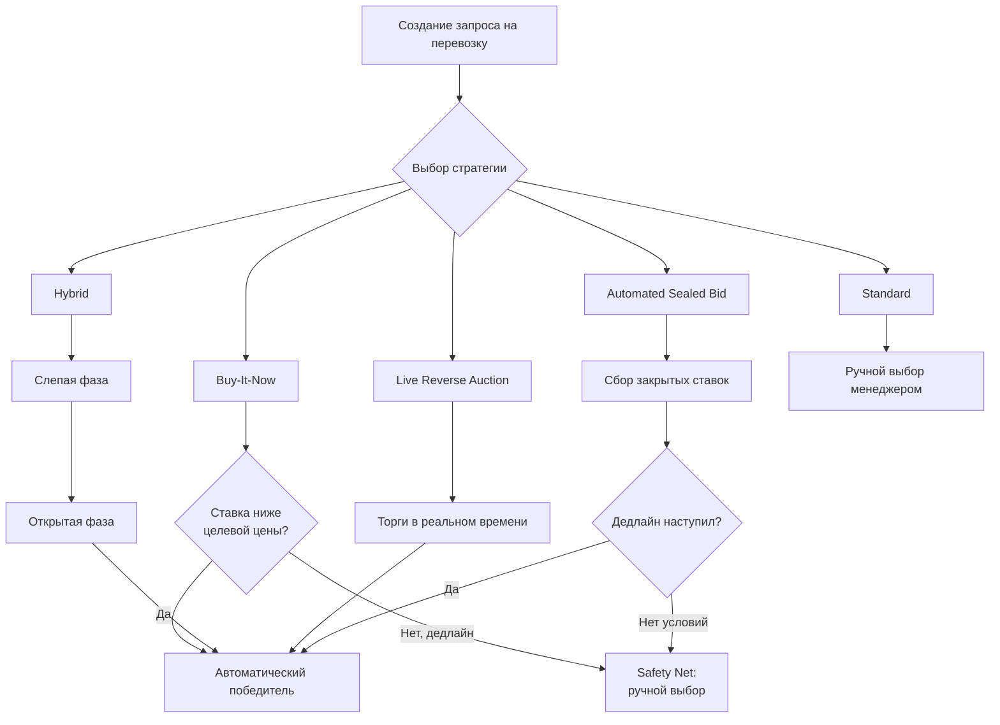

# Quote Strategy — автоматический выбор перевозчика

Функция автоматизированного выбора перевозчика через конкурентные торги. Доступна на тарифах **TMS Advanced** и **BUY & SELL**.

Исходный документ продукта: `workspaces/documentation/product/tms/procurement/quote-strategy.md`

> ⚠️ **СТАТУС (2026-06-11): НЕ РЕАЛИЗОВАНО, разработка планируется.** В backend нет ни одной из 5 стратегий (только заглушка `quote_data: JSONB`). Jira: **TMS-3557 «QUOTE STRATEGIES» — To Do**, оценка июнь 2026 (design ~2d + QA ~1w). Уточнения дизайна из слайдов: Hybrid — поле **«Time till visible (mins)»** при создании QR; Reverse Auction — **без отдельного таймера**, до Answer Before deadline («at the exact deadline, the lowest bidder automatically wins»), опциональный Reserve Price; Safety Net — единое hardcoded-поведение: **«QR loops back to normal quote»**, Shipper выбирает вручную из собранных ставок.

---

## Назначение

Quote Strategy позволяет автоматически определить победителя торгов по грузоотправке без ручного вмешательства менеджера. Система применяет одну из 5 стратегий к входящим ставкам перевозчиков и автоматически выбирает победителя при выполнении условий.

Функция **не использует ML-модели**: логика реализована через детерминированные правила платформы.

---

## Доступность

| Тариф | Доступность |
|---|---|
| TMS Advanced | Да |
| BUY & SELL | Да |
| TMS Basic | Нет |
| TMS Standard | Нет |

---

## Стратегии

### 1. Standard (стандартная)
Классический процесс без автоматики. Менеджер вручную выбирает победителя из полученных ставок после дедлайна.

### 2. Buy-It-Now
Первый перевозчик, предложивший ставку **ниже целевой цены**, автоматически получает груз. Торги закрываются немедленно.

- Требует задания целевой цены (`target price`) при создании запроса.
- Все остальные ставки отклоняются автоматически.

### 3. Hybrid
Двухфазный процесс:

1. **Фаза слепых торгов (sealed phase)** — перевозчики подают ставки, не видя предложений конкурентов.
2. **Фаза открытых торгов (open phase)** — ставки становятся видны, перевозчики могут пересмотреть предложения.

После завершения открытой фазы система автоматически определяет победителя по минимальной ставке.

### 4. Live Reverse Auction (живой обратный аукцион)
Открытые торги в реальном времени. Перевозчики видят текущую минимальную ставку и могут её перебить до наступления дедлайна. По истечении времени победитель выбирается автоматически.

### 5. Automated Sealed Bid (автоматизированный закрытый тендер)
Все ставки принимаются в закрытом режиме до дедлайна. По истечении дедлайна система **автоматически** выбирает победителя по минимальной цене без участия менеджера.

---

## Safety Net (предохранительный механизм)

Если ни одна из условий стратегии не выполнена до дедлайна (например, ни одна ставка не опустилась ниже Buy-It-Now цены), система **автоматически переключается на ручной выбор**. Менеджер получает уведомление и выбирает победителя вручную из доступных ставок.

---

## Схема выбора стратегии

---

## Ограничения

- Buy-It-Now требует задания `target price` при создании запроса.
- Hybrid и Live Reverse Auction требуют активности перевозчиков в течение двух фаз.
- Safety Net всегда активен — автовыбор никогда не оставит груз без победителя.

---

## 🔗 Граф-метаданные
- **id:** `ai.features.quote-strategy`
- **type:** module-doc · **domain:** AI · **status:** implemented
- **confluence:** 632422401 · **repo:** `ai/features/quote-strategy.md`
- **code_refs:** TODO (заполнить при углублении)
- **modules:** AI
- **references:** —
- **requirements:** см. чеклисты/RTM (source backfill — волна 7.2)

