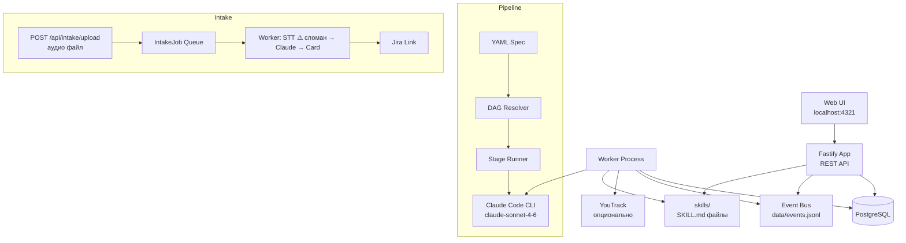

# AI Orchestrator — архитектура и устройство

AI Orchestrator — внутренний сервис Shiptify для запуска многоэтапных AI-агентных пайплайнов и автоматизации QA. Не является частью основного TMS-бэкенда.

Репозиторий: `c:/Users/Lenovo/Desktop/12devs/shiptify/code/ai-orchestrator/`

---

## Назначение

Сервис решает две задачи:

1. **Pipeline Orchestrator** — выполнение многостадийных AI-пайплайнов по YAML-спецификации. Используется для автоматизации QA: анализ требований → трассировка → написание Playwright-тестов → code review.

2. **Intake Pipeline** — конвертация голосового сообщения или текста в структурированную задачу (RequirementCard) и создание задачи в Jira.

---

## Стек технологий

| Компонент | Технология |
|---|---|
| HTTP-сервер | Fastify (TypeScript), порт 4321 |
| ORM | Prisma |
| База данных | PostgreSQL |
| LLM | **Anthropic Claude `claude-sonnet-4-6`** через Claude Code CLI (заменил OpenAI 2026-06-08, коммит 5039866) |
| Транскрипция | ⚠️ **Сломана** — Whisper удалён вместе с OpenAI; `transcribeAudioFile()` бросает ошибку. Нужен новый STT-провайдер |
| Браузер (тесты) | Playwright, только Chromium headless |
| Деплой | Docker Compose |
| Трекер | YouTrack (опционально; чтение + комментарии/смена статуса, webhook + poll) |

> ⚠️ Известный техдолг (аудит 2026-06-11): **нет timeout на выполнение стейджа** — зависший агент висит бесконечно (есть только `CALLBACK_TIMEOUT_MS=10000` и `WORKER_POLL_MS=2000`).

---

## Компоненты системы



---

## Pipeline Orchestrator

### YAML-спецификация пайплайна

Пайплайн описывается как YAML-файл со стадиями:

```yaml
version: 1
name: qa-core-mvp
mode: synchronous_with_future_parallel_lanes
stages:
  - id: manager_triage
    role: 00-manager

  - id: repo_intake
    skill: 10-repo-intake
    depends_on: [manager_triage]

  - id: requirements_structuring
    role: 01-analyst
    depends_on: [repo_intake]

  - id: traceability
    skill: 11-test-traceability-mapper
    depends_on: [requirements_structuring]

  - id: atomic_tests
    skill: 12-test-case-splitter
    depends_on: [traceability]

  - id: approval_gate
    role: 00-manager
    depends_on: [atomic_tests]
    gates:
      - explicit_human_approval_required_for_implementation

  - id: implementation
    skill: 13-playwright-writer
    depends_on: [approval_gate]
    gates:
      - approved_scope_present

  - id: assertion_hardening
    skill: 14-assertion-injector
    depends_on: [implementation]

  - id: stabilization
    skill: 16-flake-reviewer
    depends_on: [assertion_hardening]

  - id: critic_review
    role: 06-critic
    depends_on: [stabilization]

  - id: final_status
    role: 00-manager
    depends_on: [critic_review]
    gates:
      - artifacts_present
```

Спецификация пайплайна QA: `core/orchestration/pipeline.v1.yaml`
Спецификация docgen-пайплайна: `core/orchestration/docgen.pipeline.v1.yaml`

### DAG и зависимости стадий

Стадии выполняются в порядке зависимостей. Воркер сканирует `PENDING`-стадии, проверяет, что все `depends_on` в статусе `DONE` или `SKIPPED`, и запускает следующую готовую стадию.

### Визуализация DAG

Для каждого pipeline run автоматически генерируется Mermaid-диаграмма с цветовой аннотацией статусов стадий (`done` / `running` / `pending` / `failed` / `skipped`).

Код генерации: `src/pipeline.ts` → `pipelineToMermaid()`

### Машина состояний

```
PENDING → RUNNING → DONE
                  → FAILED
                  → SKIPPED
```

### Контракт выхода стадии

Каждая стадия должна вернуть JSON:

```json
{
  "summary": "Краткое описание результата",
  "artifacts": [
    {
      "kind": "stage_result_raw",
      "name": "имя_файла.json",
      "contentType": "application/json",
      "text": "содержимое артефакта"
    }
  ],
  "next": [
    { "stageId": "следующая_стадия", "reason": "причина" }
  ]
}
```

---

## Система скиллов

Скиллы — это Markdown-файлы (SKILL.md), описывающие роль агента, входные/выходные данные и правила работы.

Папка скиллов: `skills/`
Загрузка: `src/skills.ts` → `loadSkillMarkdown(roleOrSkill)`

При запуске стадии воркер:
1. Загружает `SKILL.md` для указанной роли/скилла.
2. Строит полный промпт: системная инструкция + SKILL.md + входные данные + результаты upstream-стадий.
3. Вызывает Claude Code CLI (`runClaudeCli`, `src/llm.ts`).
4. Сохраняет результат, токены, модель.

---

## Интеграция с YouTrack

Если в `run.externalRef` указан идентификатор в формате `youtrack:<issue-id>`, воркер автоматически переводит задачу YouTrack в статус `Done` после завершения пайплайна.

Настройка:

```env
YOUTRACK_ENABLED=1
YOUTRACK_BASE_URL=https://your.youtrack.cloud
YOUTRACK_TOKEN=your-token
YOUTRACK_DONE_STATE=Done
YOUTRACK_QUERY=State: {To Do} summary: "[AI]"
```

---

## Event Bus

Воркер публикует структурированные события в JSONL-файл `data/events.jsonl`. Типы событий:

| Тип | Когда |
|---|---|
| `stage.status` | Старт, завершение, ошибка стадии |
| `tool.start` | Начало вызова OpenAI |
| `tool.end` | Завершение вызова OpenAI |
| `stage.result` | Результат стадии |
| `run.status` | Изменение статуса всего run |

Код: `src/bus/sink.ts`, `src/bus/events.ts`

---

## Mock-режим

Для локальной разработки без реального LLM:

```env
MOCK_LLM=1
```

Воркер возвращает stub-результаты без вызова Claude.

---

## Быстрый старт

```bash
cp .env.example .env
# Авторизовать Claude CLI: claude auth login (или задать ANTHROPIC_API_KEY)
docker compose up --build
# UI: http://localhost:4321
# DB: localhost:54321
```

> Переменные `OPENAI_*` в .env.example/k8s — legacy, не используются после перехода на Claude CLI.

---

## Связанные документы

- [skills.md](skills.md) — каталог всех 23 скиллов
- [intake-flow.md](intake-flow.md) — Intake Pipeline
- [../external-services.md](../external-services.md) — внешние AI-сервисы

---

## 🔗 Граф-метаданные
- **id:** `ai.orchestrator`
- **type:** module-doc · **domain:** AI · **status:** implemented
- **confluence:** 632487937 · **repo:** `ai/orchestrator/README.md`
- **code_refs:** TODO (заполнить при углублении)
- **modules:** AI
- **references:** —
- **requirements:** см. чеклисты/RTM (source backfill — волна 7.2)

