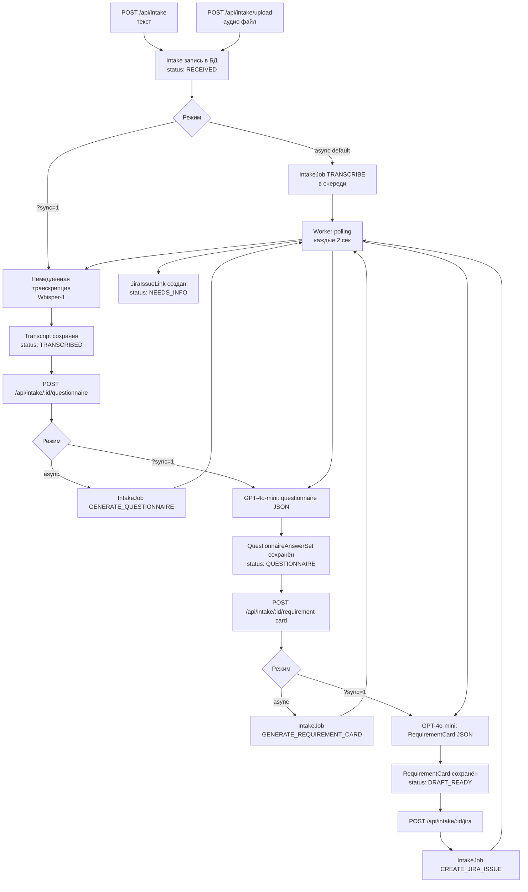

# Intake Pipeline — голос/текст в задачу Jira

Intake Pipeline — подсистема AI Orchestrator для превращения голосового сообщения или текстового описания в структурированный RequirementCard и задачу в Jira.

Ключевые файлы:
- `src/intake.ts` — регистрация API-маршрутов
- `src/requirementIntake.ts` — генерация questionnaire и RequirementCard через GPT
- `src/intakeJobs.ts` — очередь асинхронных задач
- `src/worker.ts` — воркер, обрабатывающий задачи

---

## Полный поток данных



---

## API эндпоинты

### POST /api/intake — создать intake (текст)

```http
POST /api/intake
Content-Type: application/json

{
  "customerName": "Acme Corp",
  "customerEmail": "pm@acme.com",
  "customerId": "acme-001",
  "inputKind": "text",
  "inputText": "Нам нужна функция автозаполнения адреса при создании отправки",
  "locale": "ru",
  "source": "slack"
}
```

Ответ `201`:
```json
{
  "id": "clyxxx...",
  "status": "RECEIVED",
  "createdAt": "2026-06-05T10:00:00.000Z"
}
```

---

### POST /api/intake/upload — создать intake с аудио

```http
POST /api/intake/upload
Content-Type: multipart/form-data

customerName=Acme Corp
customerEmail=pm@acme.com
inputKind=voice
locale=ru
audio=<audio_file.webm>
```

Поддерживаемые форматы: `webm`, `wav`, `mp3`, `m4a`, `ogg`.

Ответ `201`:
```json
{
  "id": "clyxxx...",
  "status": "RECEIVED",
  "audioPath": "data/intakes/clyxxx.../audio.webm"
}
```

---

### POST /api/intake/:id/transcribe — транскрипция аудио

```http
POST /api/intake/clyxxx.../transcribe
```

По умолчанию (async): возвращает `202`, запускает воркер-задачу.

```json
{ "ok": true, "jobId": "job_...", "enqueued": true }
```

С параметром `?sync=1`: выполняет немедленно.

```json
{ "ok": true, "transcriptId": "tr_...", "sync": true }
```

Используемая модель: `whisper-1` (переопределяется через `OPENAI_TRANSCRIBE_MODEL`).

---

### POST /api/intake/:id/questionnaire — генерация анкеты

```http
POST /api/intake/clyxxx.../questionnaire
```

GPT анализирует транскрипт и извлекает структурированную анкету.

По умолчанию (async): `202` + `jobId`.

С `?sync=1`:
```json
{ "ok": true, "questionnaireId": "q_...", "sync": true }
```

**Структура questionnaire:**
```json
{
  "goal": "Автозаполнение адреса при создании отправки",
  "context": "Пользователи тратят много времени на ввод адресов вручную",
  "actors": ["Оператор TMS", "Менеджер по логистике"],
  "constraints": ["Только для зарегистрированных адресов"],
  "inScope": ["Автодополнение при вводе", "Выбор из адресной книги"],
  "outOfScope": ["Валидация адреса через внешний API"],
  "acceptanceCriteria": ["При вводе 3+ символов появляются подсказки"],
  "openQuestions": ["Нужна ли интеграция с Google Places?"],
  "jira": {
    "projectKey": "TMS",
    "issueType": "Story",
    "labels": ["ux", "intake"]
  }
}
```

Промпт в `src/requirementIntake.ts`: `generateQuestionnaireFromTranscript()`.

---

### POST /api/intake/:id/requirement-card — генерация RequirementCard

```http
POST /api/intake/clyxxx.../requirement-card
```

GPT генерирует структурированную карточку требования на основе questionnaire.

По умолчанию (async): `202` + `jobId`.

С `?sync=1`:
```json
{ "ok": true, "requirementCardId": "rc_...", "sync": true }
```

**Структура RequirementCard:**
```json
{
  "title": "Автозаполнение адреса при создании отправки",
  "summary": "Пользователи могут выбрать адрес из подсказок при вводе...",
  "userStory": "Как оператор TMS, я хочу видеть подсказки адресов...",
  "scope": { "in": ["..."], "out": ["..."] },
  "affectedArea": ["Форма создания отправки", "Адресная книга"],
  "acceptanceCriteria": ["..."],
  "openQuestions": ["..."],
  "attachments": [],
  "markdown": "# Автозаполнение адреса\n\n..."
}
```

Промпт в `src/requirementIntake.ts`: `generateRequirementCardFromQuestionnaire()`.

---

### POST /api/intake/:id/jira — создание задачи в Jira

```http
POST /api/intake/clyxxx.../jira
```

Запускает асинхронную задачу создания Jira-issue. Всегда `202` (только async).

```json
{ "ok": true, "jobId": "job_...", "enqueued": true }
```

**Статус интеграции:** Jira-интеграция реализована как stub. Создаётся `JiraIssueLink` с маркером `intake:<id>`, статус `NEEDS_INFO`. Полная авторизация и создание issue не реализованы.

---

### GET /api/intake — список intake

```http
GET /api/intake?limit=50&status=DRAFT_READY
```

Ответ:
```json
{
  "intakes": [
    {
      "id": "...",
      "createdAt": "...",
      "customerName": "...",
      "inputKind": "voice",
      "status": "DRAFT_READY",
      "hasTranscript": true,
      "hasQuestionnaire": true,
      "hasRequirementCard": true,
      "jiraIssueKey": null
    }
  ]
}
```

### GET /api/intake/:id — детали intake

Возвращает полный объект с вложенными: `transcript`, `questionnaire`, `requirementCard`, `jiraLink`, `events`.

---

## Статусы Intake

| Статус | Описание |
|---|---|
| `RECEIVED` | Intake создан |
| `TRANSCRIBED` | Аудио транскрибировано |
| `QUESTIONNAIRE` | Анкета сгенерирована |
| `DRAFT_READY` | RequirementCard готов |
| `NEEDS_INFO` | Задача в Jira создана (stub) |
| `ERROR` | Ошибка при обработке |

---

## Воркер и очередь задач

Воркер (`src/worker.ts`) опрашивает таблицу `IntakeJob` каждые `WORKER_POLL_MS` мс (по умолчанию 2000).

### Типы задач

| Тип | Описание |
|---|---|
| `TRANSCRIBE` | Транскрипция аудио через Whisper-1 |
| `GENERATE_QUESTIONNAIRE` | Генерация анкеты через GPT-4o-mini |
| `GENERATE_REQUIREMENT_CARD` | Генерация RequirementCard через GPT-4o-mini |
| `CREATE_JIRA_ISSUE` | Создание Jira-issue (stub) |

### Backoff при ошибках

При ошибке задача переходит обратно в `PENDING` с экспоненциальным задержкой:

```
попытка 1: 1 мин
попытка 2: 2 мин
попытка 3: 4 мин
...
максимум: 30 мин
```

### Состояния задачи

```
PENDING → RUNNING → DONE
                  → PENDING (retry с задержкой)
```

---

## Конфигурация

| Переменная | По умолчанию | Описание |
|---|---|---|
| `OPENAI_API_KEY` | — | API ключ OpenAI (обязателен) |
| `OPENAI_API_KEY_FILE` | — | Путь к файлу с ключом (для Docker secrets) |
| `OPENAI_MODEL` | `gpt-4o-mini` | Модель для questionnaire и RequirementCard |
| `OPENAI_TRANSCRIBE_MODEL` | `whisper-1` | Модель транскрипции |
| `WORKER_POLL_MS` | `2000` | Интервал опроса очереди (мс) |
| `MOCK_LLM` | `0` | `1` — stub-режим без реального OpenAI |

---

## 🔗 Граф-метаданные
- **id:** `ai.orchestrator.intake-flow`
- **type:** module-doc · **domain:** AI · **status:** implemented
- **confluence:** 632520705 · **repo:** `ai/orchestrator/intake-flow.md`
- **code_refs:** TODO (заполнить при углублении)
- **modules:** AI
- **references:** —
- **requirements:** см. чеклисты/RTM (source backfill — волна 7.2)

