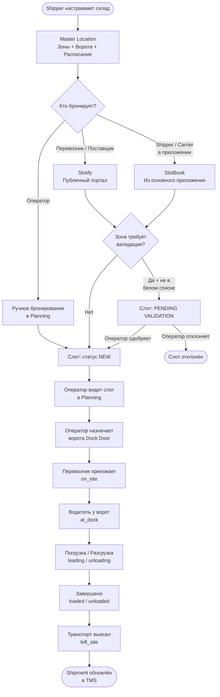

# Как работает DOCK: полный процесс

Этот раздел описывает жизненный цикл слота — от настройки склада до завершения рейса.

---

## Обзорная диаграмма



---

## Шаг 1 — Настройка склада (один раз)

Shipper настраивает свой склад в системе.

**Что нужно настроить:**

| Элемент | Что задаётся |
|---------|-------------|
| Master Location | Физический адрес склада |
| Зона | Название, направление (Приёмка / Отгрузка), расписание |
| Ворота | Количество, имена, характеристики (ADR, рефрижератор и т.д.) |
| Расписание | Рабочие часы по дням, закрытые дни |
| Вместимость | Количество одновременных доков, типы грузов |
| Режим | Включить/отключить валидацию новых броней |

После настройки система генерирует уникальный токен зоны. Ссылка вида `app.slotify.com/{токен}` передаётся партнёрам.

---

## Шаг 2 — Бронирование слота

Три способа создать слот:

### Способ A: Через Slotify (внешние пользователи)

1. Перевозчик / поставщик открывает ссылку
2. Проходит 6-шаговую форму: тип операции → контакты → компания → груз → дата/время → подтверждение
3. Система рассчитывает длительность слота автоматически
4. Слот создаётся и появляется в Planning оператора

### Способ B: Через SlotBook (авторизованные пользователи)

1. Shipper или Carrier в приложении нажимают «Забронировать слот»
2. Выбирают перевозчика из контактов или добавляют нового
3. Указывают груз, дату, время
4. Слот создаётся немедленно

### Способ C: Ручное бронирование оператором

1. Оператор открывает Planning
2. Нажимает на пустую ячейку в нужное время
3. Заполняет форму создания слота

---

## Шаг 3 — Подтверждение (при включённой валидации)

Если зона работает в режиме валидации:

```
Новая бронь
    │
    ▼
Статус: PENDING VALIDATION
    │
Оператор получает уведомление
    │
    ├── Одобрить → статус NEW (слот активен)
    └── Отклонить → статус DECLINED (бронь аннулирована)
```

Поставщики из белого списка проходят без проверки.

---

## Шаг 4 — Назначение ворот

Оператор в Planning открывает страницу назначения ворот (`/slotify/load/YYYY-MM-DD`):

- Видит все слоты на день
- Перетаскивает неназначенные слоты на конкретные ворота
- Система автоматически подсвечивает конфликты (оранжевый цвет)

---

## Шаг 5 — Приезд и обслуживание транспорта

Когда транспорт прибывает, оператор обновляет статус через единый модал:

```
NEW (запланирован)
    │
    ▼
DRIVER_CALLED (водитель уведомлён)
    │
    ▼
ON_SITE (транспорт на территории)
    │
    ▼
AT_DOCK (у ворот)
    │
    ▼
LOADING / UNLOADING (идёт операция)
    │
    ▼
LOADED / UNLOADED (операция завершена)
    │
    ▼
LEFT_SITE (транспорт выехал)
```

Каждый переход статуса фиксируется с датой и временем. Можно указать точное время вручную (backdating).

---

## Шаг 6 — Завершение и передача данных

После завершения слота:
- Статус отправки (Shipment) в TMS обновляется автоматически
- История статусов слота сохраняется для аудита
- Данные доступны для экспорта в Excel и анализа

---

## Нестандартные ситуации

| Ситуация | Что происходит |
|----------|---------------|
| Транспорт не приехал | Оператор отмечает NO_SHOW — слот закрывается |
| Транспорт отказали у ворот | Статус REFUSED — причина фиксируется |
| Бронь отменена заранее | Статус CANCELLED — партнёр получает уведомление |
| Транспорт опоздал | Оператор видит отставание от расписания, решает принять или перенести |

---

## Как рассчитывается длительность слота

Система автоматически определяет, сколько времени займёт операция:

```
Длительность = (время на груз) + (фиксированное время зоны)

Время на груз:
  = кол-во единиц на полу × минут/ед. (для пола)
  + кол-во единиц в стопке × минут/ед. (для стопки)

Результат округляется вверх до ближайшего шага сетки (15 / 30 / 60 мин)
```

**Пример:**
```
Заказ: 10 паллет (6 на полу, 4 в стопке)
  На полу:    6 × 20 мин = 120 мин
  В стопке:   4 × 10 мин = 40 мин
  Итого груз: 160 мин
  + буфер зоны: 30 мин
  Итого: 190 мин → округление до 30-мин сетки = 3 ч 30 мин
```

---

## 🔗 Граф-метаданные
- **id:** `dock.external.04_how-it-works`
- **type:** module-doc · **domain:** DOCK · **status:** implemented
- **confluence:** 631341076 · **repo:** `dock/external/04_how-it-works.md`
- **code_refs:** TODO (заполнить при углублении)
- **modules:** DOCK
- **references:** —
- **requirements:** см. чеклисты/RTM (source backfill — волна 7.2)

