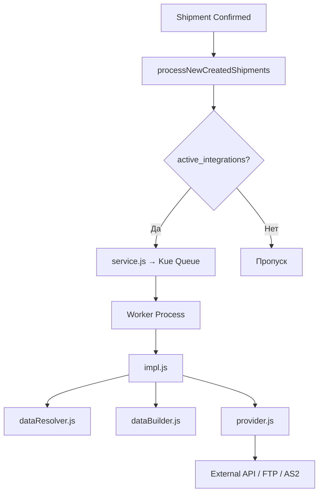

# Интеграции Shiptify — Обзор

Shiptify интегрируется с более чем 25 внешними системами: перевозчиками, трекинговыми платформами, ERP-системами, WMS и специализированными сервисами. Все интеграции следуют единой очередной архитектуре (Main App → Kue Queue → Workers).

---

## Структура документации

| Раздел | Содержимое |
|--------|-----------|
| [architecture/](architecture/README.md) | Техническая архитектура, DB-таблицы, добавление новой интеграции |
| [carriers/](carriers/README.md) | Все перевозчики (DHL, FedEx, UPS, DB Schenker и др.) |
| [tracking/](tracking/README.md) | Трекинговые платформы (P44, Shippeo, AfterShip) |
| [erp/](erp/README.md) | ERP-интеграции (SAP, Public API) |
| [edi/](edi/README.md) | EDI-интеграции (BIC DESADV, SFTP, EDIFACT) |
| [webhooks/](webhooks/README.md) | Вебхуки: события, форматы, жизненный цикл отправки |
| [setup-guide.md](setup-guide.md) | Пошаговая активация интеграции |

---

## Все интеграции по типам

### Перевозчики

| Интеграция | Папка | Тип подключения | Что умеет |
|-----------|-------|----------------|-----------|
| DHL | `integration/dhl/` | FTP / CSV | Трекинг по HAWB, MAWB, customer-ref |
| DHL Global Forwarding | `integration/dhl-global-forwarding/` | RPC (микросервис) | Трекинг, проверка активности |
| MyDHL (DHL API v2) | `integration/mydhl/` | RPC (микросервис) | Создание отправки, печать этикеток |
| FedEx (legacy) | `integration/fedex/` | FTP / CSV | Трекинг по CSV-файлам |
| FedEx API | `integration/fedex-api/` | REST API | Создание, отмена, пикап, POD, фрахт |
| UPS | `integration/ups/` | REST API | Трекинг, ZPL-этикетки, вложения |
| DB Schenker | `integration/db-schenker/` | EDIFACT / FTP | IFTMIN (бронирование), IFTSTA (трекинг) |
| Heppner | `integration/heppner/` | REST API | Бронирование, POD, инфо-запросы |
| Kuehne+Nagel | `integration/kuehne-nagel/` | REST API (OAuth2) | Трекинг cargo/information flow, документы |
| Dachser | `integration/dachser/` | REST API | Скачивание POD-документов |
| Dimotrans | `integration/dimotrans/` | REST API | Трекинг (polling) |
| Teliae | `integration/teliae/` | FTP / CSV | Бронирование, трекинг, этикетки ZPL→PDF |
| Teliway | `integration/teliway/` | EDIFACT / FTP | DISPOR (бронирование), REPORT (трекинг) |
| Calvacom | `integration/calvacom/` | EDIFACT / FTP | DISPOR (бронирование), REPORT (трекинг), POD |
| Brinks | `integration/brinks/` | REST API | Трекинг ценных грузов, POD, этикетки |
| LivingPackets | `integration/livingpacket/` | REST API (OAuth2) | Создание отправки (умная упаковка) |
| INTTRA | `integration/inttra/` | AS2 / XML вебхук | Бронирование морских перевозок |
| Terrial | `integration/terrial/` | REST API | Подтверждение отправки |

### Трекинговые платформы

| Интеграция | Папка | Тип | Что умеет |
|-----------|-------|-----|-----------|
| P44 (Project44) | `integration/p44/` | REST API (polling) | Создание, трекинг, ETA, карта трекинга |
| Shippeo | `integration/shippeo/` | REST API + вебхук | GPS-трекинг в реальном времени |
| AfterShip | `integration/aftership/` | RPC + вебхук | Мультиперевозчик, уведомления клиентам |
| Marine Traffic (Kpler) | `integration/marine-traffic/` | REST API | Морские перевозки, vessel tracking |

### ERP и бизнес-системы

| Интеграция | Папка | Тип | Что умеет |
|-----------|-------|-----|-----------|
| SAP | `integration/sap/` | REST API (двунаправленная) | Создание/обновление заявок, уведомления |
| HubSpot | `integration/hubspot/` | REST API | CRM: контакты, клиенты |
| Peripass | `integration/peripass/` | REST API + вебхук | Gate management, слоты |
| Ecotransit | `integration/ecotransit/` | FTP / CSV | Расчёт CO₂, дистанция |
| Reflex WMS | `integration/reflex/` | REST API | Исходящий вебхук при создании отправки |

---

## EDI / Специализированные

| Интеграция | Тип | Описание |
|-----------|-----|---------|
| BIC DESADV | SFTP / EDIFACT | Входящие EDI от WMS → создание Shipments (отдельный микросервис) |
| DHL Inovert | EDIFACT / FTP | DHL через промежуточный сервис Inovert |
| DHL FCA | FTP / CSV | DHL FCA-вариант |

---

## Архитектура (кратко)

Подробнее: [architecture/README.md](architecture/README.md)

---

## Паттерны интеграций

| Паттерн | Используется в |
|---------|---------------|
| REST API booking (outbound) | Heppner, SAP, P44, Shippeo, LivingPackets, Terrial |
| EDIFACT/FTP outbound | Calvacom, DB Schenker, Teliway, Teliae |
| Tracking polling (cron) | KN, P44, Shippeo, Brinks, FedEx, Marine Traffic |
| Webhook/AS2 inbound | INTTRA, AfterShip, Peripass |
| ZPL label generation | FedEx API, Teliae, UPS, MyDHL |
| RPC microservice | AfterShip, DHL Global Forwarding, MyDHL |

---

## Связанные документы

- [Техническое руководство по активации](setup-guide.md)
- [onboarding/06_integrations-technical.md](../onboarding/06_integrations-technical.md)
- [tms/implementation/integrations/README.md](../tms/implementation/integrations/README.md)
- [integrations/bic-desadv/README.md](bic-desadv/README.md)

---

## Сверено с кодом (2026-06-11) — архитектурные факты

- **RPC-сервисы** (MyDHL, DHL GF, AfterShip) — отдельный сервис **`integrations-app:3000`** (workspace `workspaces/integrations`); ENV: `RPC_MYDHL_URL`, `RPC_DHL_GF_URL`, `RPC_AFTERSHIP_URL`
- **Деактивация** интеграции — только soft delete `active_integrations.deleted_at` (paranoid); поля `is_active` не существует
- **Retry** — per-integration массивы задержек (`lib/delayedRetryJob.js`): Teliae `[]`, Teliway/DHL DISPOR/webhooks `[30,60,240,1440]`, Terrial `[60,1440]`
- **STY-коды**: полный словарь — **367 кодов** (STY0000..STY0366 + STY9999) в `public-api/src/services/tracking/dictionary/sty.js`
- **Cron**: 21 интеграционная задача (p44, teliae×3, teliway per-env, marine-traffic×2, brinks×3, calvacom, dachser, db-schenker, dimotrans, ecotransit×2, fedex-api×2, fedex-express, kuehne-nagel)
- **Ярлыки (ZPL→PDF)**: Teliae (Labelary API, батчи по 48), FedEx API, UPS; Dachser/Brinks — только POD
- ⚠️ **Риск**: P44 + Shippeo одновременно создают дубль tracking points (источник в `tracking.tag`, приоритета/дедупа между источниками нет)
- **Не реализовано**: BIC DESADV (кода нет нигде), SAP Invoice sync (только generic webhook на VALIDATED)

Полный аудит: [OPEN-QUESTIONS.md](OPEN-QUESTIONS.md)

**Внешний контур и отдельные сервисы:** [public-api/README.md](public-api/README.md) — публичный REST API для внешних интеграторов (отдельный сервис `workspaces/public-api`, 583 файла). Brinks/UPS реализованы как отдельные NestJS-сервисы: [carriers/brinks.md](carriers/brinks.md), [carriers/ups.md](carriers/ups.md).

---

## 🔗 Граф-метаданные
- **id:** `integrations`
- **type:** overview · **domain:** Integrations · **status:** implemented
- **confluence:** 631701555 · **repo:** `integrations/README.md`
- **code_refs:** TODO (заполнить при углублении)
- **modules:** Integrations
- **references:** —
- **requirements:** см. чеклисты/RTM (source backfill — волна 7.2)

