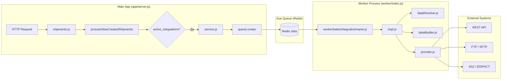

# Архитектура интеграций

Все интеграции в Shiptify работают через двухпроцессную очередную архитектуру. Основное приложение (Main App) выбрасывает задачи в очередь Redis, воркеры (Workers) забирают задачи и выполняют логику интеграции.

---

## Общая схема



**Main App** и **Workers** запускаются как два **независимых процесса**. Main App никогда не импортирует `impl.js` — только `service.js`. Workers никогда не импортируют `service.js` — только `impl.js`.

---

## Структура файлов интеграции

Каждая интеграция живёт в папке `app/services/integration/<name>/`:

```
app/services/integration/<name>/
  service.js          ← выбрасывает задачу в очередь (импортируется Main App)
  impl.js             ← высокоуровневая логика (импортируется Workers)
  provider.js         ← API-клиент (HTTP/FTP/AS2)
  dataBuilder.js      ← Shiptify данные → внешний DTO
  dataResolver.js     ← загружает данные из БД для интеграции
  constants.js        ← константы (нет внешних зависимостей)
  helper.js           ← утилиты
  tasks.js            ← cron-задачи для app/cron/
```

Не все файлы обязательны. Минимальная интеграция: `service.js` + `impl.js`.

---

## Таблицы базы данных

### `integration_settings`

Определяет существование и параметры интеграции:

```sql
CREATE TABLE integration_settings (
    id                    SERIAL PRIMARY KEY,
    integration_name      VARCHAR(255) NOT NULL,   -- e.g. 'kuehne-nagel', 'teliae'
    shipment_mode_id      INTEGER,                 -- Air/Sea/Road (NULL = все режимы)
    metadata_prototype_id INTEGER,                 -- прототип поля метаданных для tracking ref
    reference_field_name  VARCHAR(255),            -- тип референса: 'HAWB', 'ALL_CUSTOMER_REFERENCES'
    created_at            TIMESTAMPTZ,
    updated_at            TIMESTAMPTZ,
    deleted_at            TIMESTAMPTZ              -- soft delete
);
```

### `active_integrations`

Активирует интеграцию для конкретной пары Shipper + Carrier:

```sql
CREATE TABLE active_integrations (
    id                      SERIAL PRIMARY KEY,
    shipper_id              INTEGER NOT NULL,        -- FK → accounts (shipper)
    carrier_id              INTEGER NOT NULL,        -- FK → accounts (carrier)
    shipper_code            VARCHAR(255),            -- код клиента на стороне перевозчика
    carrier_code            VARCHAR(255),            -- код перевозчика
    integration_setting_id  INTEGER,                 -- FK → integration_settings
    carrier_product_code    VARCHAR(255),            -- продукт/сервис перевозчика
    accounting_entity_id    INTEGER,                 -- FK → accounting entity
    created_at              TIMESTAMPTZ,
    updated_at              TIMESTAMPTZ,
    deleted_at              TIMESTAMPTZ              -- soft delete
);
```

**Правило активации:** интеграция срабатывает ТОЛЬКО если обе таблицы содержат совпадающие записи для текущей пары shipper_id + carrier_id.

### `shipment_integration_<name>`

Каждая интеграция хранит свои данные о связи отправки с внешней системой:

```sql
-- Пример: shipment_integration_p44
CREATE TABLE shipment_integration_p44 (
    id                    SERIAL PRIMARY KEY,
    shipment_id           INTEGER,          -- FK → shipments
    internal_shipment_id  VARCHAR(255),     -- ID в системе P44
    tracking_number       VARCHAR(255),     -- трекинговый номер
    created_at            TIMESTAMPTZ,
    updated_at            TIMESTAMPTZ
);
```

Аналогичные таблицы: `shipment_integration_aftership`, `shipment_integration_living_packets`, `shipment_integration_teliae_data` и др.

---

## Когда срабатывает интеграция

```
Пользователь подтверждает Shipment (Confirm Assignment)
    ↓
app/services/shipments.js → processNewCreatedShipments()
    ↓
SELECT * FROM active_integrations
    WHERE shipper_id = ? AND carrier_id = ?
    AND deleted_at IS NULL
    ↓
Если запись найдена → service.js.enqueueJob(shipmentId, params)
    ↓
queue.create('integration-<name>', { shipmentId, shipperId, carrierId })
    ↓
Workers слушают очередь → worker/tasks/integration/<name>.js
    ↓
impl.js(shipmentId, shipperId, carrierId)
```

---

## Типы триггеров

| Триггер | Интеграции |
|---------|-----------|
| `shipmentConfirmed` | Большинство carrier-интеграций (booking) |
| Cron (периодический) | KN, P44, Shippeo, FedEx CSV, Teliae CSV, Ecotransit ZIP, Calvacom FTP, DB Schenker FTP |
| Входящий вебхук | INTTRA (AS2), AfterShip, Peripass |
| Событие аккаунта | HubSpot (создание/обновление контактов) |

---

## Логирование

Все запросы и ответы к внешним API логируются в AWS S3:

```javascript
// app/services/integration/common/helpers/integration_logs_s3_helper.js
const logger = buildLogger('integration-dhl');
logger.info('Booking request', { shipmentId, payload });
logger.error('API error', { error, response });
// Путь в S3: integration-logs/dhl/YYYY-MM-DD/shipment-{id}.log
```

Класс `IntegrationLogger` обеспечивает структурированное логирование с привязкой к shipmentId.

---

## Retry-стратегия

```javascript
// app/lib/retryAttempts.js
const retryAttempts = (job, error, maxAttempts, retryDelays) => {
    const attempts = job.data.attempts || 0;
    if (attempts >= maxAttempts) return false; // fatal → alert в Telegram

    const delayMs = retryDelays[attempts] * 1000;
    job.failed().delay(delayMs).state('delayed').priority('high').update();
    return true;
};
```

При исчерпании попыток: уведомление в Telegram + job переходит в состояние `failed` в Kue.

---

## Отдельный микросервис (workspaces/integrations)

Для части интеграций (DHL, MyDHL, AfterShip) используется **отдельный Node.js-сервис**:

```
workspaces/integrations/
  src/
    carriers/      ← DHL, MyDHL, AfterShip sync
    cron/          ← scheduled polling tasks
    kafka/         ← Kafka consumer/producer
```

- Express 5, Sequelize 6, Kafka
- Backend обращается к нему через RPC (`rpcFetch(RPC_URL, params)`)
- Ответ 404 означает отсутствие активной интеграции

```javascript
// RPC-паттерн в основном backend
const result = await rpcFetch(`${RPC_DHL_GF_URL}/tracking`, { shipmentId });
if (!result) return; // 404 = нет активной интеграции
```

---

## Как добавить новую интеграцию

```
1. Создать папку: app/services/integration/<name>/
2. Написать constants.js — INTEGRATION_TYPE = '<name>'
3. Написать service.js — enqueue функция
   └── импортировать в Main App (app/services/shipments.js или cron)
4. Написать impl.js — основная логика
   └── импортировать в Workers (worker/index.js или worker/tasks/)
5. Написать provider.js — HTTP/FTP клиент
6. Написать dataResolver.js — загрузка данных из БД
7. Написать dataBuilder.js — маппинг в формат перевозчика
8. Добавить запись в integration_settings
9. Добавить запись в active_integrations
10. Тест: создать Booking → Confirm → проверить воркеры
```

---

## Константы интеграций

Все типы интеграций объявлены в:
```
app/services/integration/common/helpers/constants.js
```

Примеры:
```javascript
INTEGRATION_TYPES = {
    AFTERSHIP: 'aftership',
    DB_SCHENKER: 'db_schenker',
    DHL: 'dhl',
    DHL_FCA: 'dhl-fca',
    DHL_GF: 'dhl_global_forwarding',
    DHL_INOVERT: 'dhl_inovert',
    ECOTRANSIT: 'ecotransit',
    FEDEX: 'teliae-fedex',
    FEDEX_API: 'fedex-api',
    HEPPNER: 'heppner',
    KN: 'kuehne-nagel',
    LIVING_PACKETS: 'living-packets',
    MARINE_TRAFFIC: 'marine_traffic_kpler',
    MYDHL: 'mydhl',
    P44: 'p44',
    PERIPASS: 'peripass',
    SAP: 'sap',
    SHIPPEO: 'shippeo',
    TELIAE: 'teliae',
    UPS: 'ups',
    // ...
}
```

---

## 🔗 Граф-метаданные
- **id:** `integrations.architecture`
- **type:** module-doc · **domain:** Integrations · **status:** implemented
- **confluence:** 632520739 · **repo:** `integrations/architecture/README.md`
- **code_refs:** TODO (заполнить при углублении)
- **modules:** Integrations
- **references:** —
- **requirements:** см. чеклисты/RTM (source backfill — волна 7.2)

