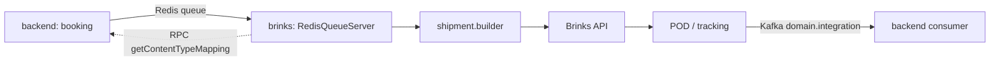

# Brinks — Интеграция (отдельный микросервис)

**Brinks** — интеграция с перевозчиком ценных грузов Brinks. В отличие от FTP/EDIFACT-перевозчиков, живущих внутри `backend/app/services/integration/`, Brinks вынесен в **отдельный репозиторий-микросервис** `workspaces/brinks` (NestJS + Prisma + Kafka). Это исторически не было задокументировано — заполняем пробел.

> Репозиторий: `workspaces/brinks` (отдельный сервис, не часть backend).

---

## 1. Зачем (бизнес)

Brinks — оператор перевозок ценных грузов (банкноты, драгметаллы, ценности). Интеграция автоматизирует:
- **Booking** — передачу отправки в систему Brinks при бронировании;
- **Tracking** — приём событий отслеживания и POD;
- **Маппинг типов груза** — сопоставление типов упаковки Shiptify с типами упаковки Brinks (например, паллета → `PALL`);
- **Логирование** интеграционных событий в общий поток (Kafka `domain.integration`) для аудита и мониторинга.

Сервис вынесен отдельно, потому что у Brinks свой жизненный цикл, своя БД учётных данных и асинхронная обработка через очередь.

---

## 2. Как устроено (код, file:line)

| Компонент | Файл | Назначение |
|-----------|------|-----------|
| Точка входа | `src/main.ts:30` | `RedisQueueServer` — слушает Redis-очередь (Kue) `integrationQueueName` от backend |
| Маппинг типов груза | `src/modules/integration/business-logic/contentTypeMapping/mapper.ts:10-17` | Shiptify content types → Brinks package types; `is_pallet → BRINKS_PACKAGE_TYPES.PALL` |
| Kafka-логирование | `src/modules/kafka/kafka.service.ts:79` | `sendToIntegrationLogQueue()` → topic `domain.integration` |
| RPC | `src/modules/rpc/rpc.service.ts:68-80` | синхронный `getContentTypeMapping` (backend валидирует типы груза перед отправкой) |
| Builders | `src/modules/integration/business-logic/*.builder.ts` | `shipment.builder`, `customs.builder`, `dates.builder`, `contactsInfo.builder`, `liteCustoms.builder`, `trackingPointDTO.builder` |

**Стек:** NestJS, Prisma 5.22 (отдельная БД: credentials, shipments, documents, settings), Kue (Redis), KafkaJS, Telegram (алерты об ошибках).

### Поток данных

---

## 3. Где найти и настроить

- **Активация:** запись в `integration_settings` (`integration_name = 'brinks'`) + `active_integrations` для пары shipper↔carrier (как у прочих интеграций, см. [setup-guide.md](../setup-guide.md)).
- **Учётные данные Brinks** хранятся в собственной БД сервиса (Prisma `schema.prisma`), не в backend.
- **Admin-App** → Active Integrations: интеграция отображается как активная для аккаунта.
- **Маппинг типов груза** настраивается через справочник `dict_sh_request_content_types`; несопоставленные типы возвращаются RPC-методом `GetCandidatesForUnmapped`.

> 📷 Скриншоты UI активации — см. [SCREENSHOTS-TODO.md](../../SCREENSHOTS-TODO.md).

---

## 4. Сценарии

1. **Бронирование через Brinks.** Shipper бронирует отправку у carrier с активной Brinks-интеграцией → backend кладёт задачу в Redis-очередь → сервис строит DTO (`shipment.builder`) → отправляет в Brinks API → лог события уходит в Kafka.
2. **Несопоставленный тип груза.** При бронировании backend через RPC `getContentTypeMapping` проверяет, что все типы упаковки имеют маппинг. Если нет — отправка блокируется/помечается, оператор донастраивает маппинг.
3. **Приём POD.** Brinks присылает подтверждение доставки → сервис формирует tracking point (`trackingPointDTO.builder`) → событие публикуется в `domain.integration` → backend обновляет статус отправки.
4. **Ошибка интеграции.** При сбое сервис шлёт алерт в Telegram и пишет лог в Kafka для разбора.

---

## Связанные документы

- [README.md](README.md) — все перевозчики
- [ups.md](ups.md) — UPS (аналогичная архитектура отдельного сервиса)
- [../../microservices/README.md](../../microservices/README.md) — карта микросервисов
- [../architecture/README.md](../architecture/README.md) — архитектура очередей и воркеров

---

## 🔗 Граф-метаданные
- **id:** `integrations.carriers.brinks`
- **type:** module-doc · **domain:** Integrations · **status:** implemented
- **confluence:** 629309507 · **repo:** `integrations/carriers/brinks.md`
- **code_refs:** `brinks/src/main.ts:30`, `brinks/src/modules/integration/business-logic/contentTypeMapping/mapper.ts:10-17`, `brinks/src/modules/kafka/kafka.service.ts:79`, `brinks/src/modules/rpc/rpc.service.ts:68-80`
- **modules:** Integrations, Microservices
- **references:** integrations.carriers.ups, microservices.overview, integrations.carriers (README)
- **requirements:** нет требований — реализовано как отдельный сервис (источник: код `workspaces/brinks`)
