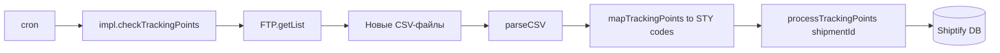

# DHL — Интеграции

DHL представлен в Shiptify в пяти вариантах. Каждый вариант — отдельная константа типа интеграции и отдельный технический стек.

---

## Обзор вариантов DHL

| Вариант | Константа | Папка | Тип подключения | Основная функция |
|---------|-----------|-------|----------------|-----------------|
| DHL основная | `dhl` | `integration/dhl/` | FTP / CSV | Трекинг по нескольким типам референсов |
| DHL Global Forwarding | `dhl_global_forwarding` | `integration/dhl-global-forwarding/` | RPC → микросервис | Трекинг экспедирования |
| MyDHL (API v2) | `mydhl` | `integration/mydhl/` | RPC → микросервис | Создание отправки, этикетки |
| DHL FCA | `dhl-fca` | _(вариант dhl)_ | FTP / CSV | Вариант для FCA-поставок |
| DHL Inovert | `dhl_inovert` | _(через teliae/env)_ | EDIFACT / FTP | DHL через промежуточный Inovert |

---

## DHL (основная интеграция)

### Технические характеристики

- **Папка:** `app/services/integration/dhl/`
- **Константа:** `INTEGRATION_TYPES.DHL = 'dhl'`
- **Тип:** FTP-опрос CSV-файлов трекинга
- **Триггер:** cron (периодический опрос)

### Типы референсов для поиска отправки

| Тип | Описание |
|-----|---------|
| `HAWB` | House Air Waybill |
| `MAWB` | Master Air Waybill |
| `customer-reference` | Референс клиента |
| `container-number` | Номер контейнера |

### Поток данных



### Структура CSV-файла

DHL присылает CSV-файлы на FTP с полями: tracking_number, event_code, event_date, event_location, description.

---

## DHL Global Forwarding

### Технические характеристики

- **Папка:** `app/services/integration/dhl-global-forwarding/`
- **Константа:** `INTEGRATION_TYPES.DHL_GF = 'dhl_global_forwarding'`
- **Тип:** RPC к отдельному микросервису `workspaces/integrations/`
- **Переменная среды:** `RPC_DHL_GF_URL`

### Файлы интеграции

```
integration/dhl-global-forwarding/
  rpc.js        ← RPC-запрос к микросервису
  provider.js   ← обёртка над rpcFetch
```

### RPC-паттерн

```javascript
// provider.js
const result = await rpcFetch(`${RPC_DHL_GF_URL}/tracking`, {
    shipmentId,
    referenceNumber
});

// Ответ 404 = интеграция не активна для данной отправки
if (!result) return null;
```

### Микросервис (workspaces/integrations)

Отдельный Express 5 / Sequelize 6 Node.js сервис:
- Порт: 3000 (по умолчанию)
- Kafka consumer/producer для синхронизации
- Cron: периодический опрос DHL API

---

## MyDHL (DHL API v2)

### Технические характеристики

- **Папка:** `app/services/integration/mydhl/`
- **Константа:** `INTEGRATION_TYPES.MYDHL = 'mydhl'`
- **Тип:** RPC к микросервису `workspaces/integrations/`
- **Переменная среды:** `RPC_MYDHL_URL`

### Функции

| Функция | Описание |
|---------|---------|
| Создание отправки | `createShipment` — регистрация на DHL API v2 |
| Печать этикеток | Возвращает ZPL/PDF этикетку |
| Проверка активности | RPC-запрос; 404 = нет активной интеграции |

### Хранение этикеток

Этикетки хранятся в S3 с **публичным доступом** (в отличие от большинства других интеграций):

```javascript
// impl.js
const labelUrl = await uploadToS3Public(labelBuffer, fileName);
await storeAttachment(shipmentId, labelUrl, 'LABEL');
```

### Задачи (tasks.js)

MyDHL имеет cron-задачи, определённые в `tasks.js` и подключаемые к `app/cron/`.

---

## DHL FCA

- **Константа:** `INTEGRATION_TYPES.DHL_FCA = 'dhl-fca'`
- Вариант основной DHL-интеграции для поставок на условиях FCA (Free Carrier)
- Технически: отдельная запись в `integration_settings` с `integration_name = 'dhl-fca'`

---

## DHL Inovert

- **Константа:** `INTEGRATION_TYPES.DHL_INOVERT = 'dhl_inovert'`
- DHL через промежуточный сервис Inovert
- Трансформер трекинга: использует `inovert` transformer (STY-коды)
- EDIFACT-окружение: `dhl_inovert`
- Настраивается через переменные среды агентства

---

## Конфигурация в базе данных

### Пример активации DHL основная

```sql
-- Шаг 1: создать запись в integration_settings
INSERT INTO integration_settings (integration_name, reference_field_name)
VALUES ('dhl', 'HAWB')
RETURNING id;
-- id = 10

-- Шаг 2: активировать для пары shipper + carrier
INSERT INTO active_integrations (
    shipper_id,
    carrier_id,
    integration_setting_id
)
VALUES (42, 15, 10);
```

### Пример активации MyDHL

```sql
-- Шаг 1
INSERT INTO integration_settings (integration_name)
VALUES ('mydhl')
RETURNING id;
-- id = 11

-- Шаг 2
INSERT INTO active_integrations (
    shipper_id,
    carrier_id,
    integration_setting_id,
    carrier_product_code    -- опционально: продукт DHL
)
VALUES (42, 15, 11, 'EXPRESS_WORLDWIDE');
```

---

## Коды событий DHL → STY

Трекинговый трансформер DHL конвертирует собственные коды DHL в внутренние STY-коды Shiptify:

| DHL event | STY-код | Значение |
|-----------|---------|---------|
| `PU` | STY0000 | Pickup (забор) |
| `DF` | STY0050 | In transit |
| `AR` | STY9999 | Arrival |
| `OK` | STY0507 | Delivered |
| `CC` | STY0510 | Customs cleared |

---

## Связанные документы

- [README.md](README.md) — все перевозчики
- [../architecture/README.md](../architecture/README.md) — архитектура очереди и воркеров
- [../setup-guide.md](../setup-guide.md) — пошаговая активация

---

## 🔗 Граф-метаданные
- **id:** `integrations.carriers.dhl`
- **type:** module-doc · **domain:** Integrations · **status:** implemented
- **confluence:** 632946721 · **repo:** `integrations/carriers/dhl.md`
- **code_refs:** TODO (заполнить при углублении)
- **modules:** Integrations
- **references:** —
- **requirements:** см. чеклисты/RTM (source backfill — волна 7.2)

