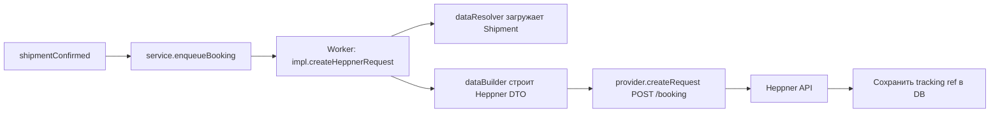

# Heppner — Интеграция

Heppner — европейский перевозчик. Интеграция реализована через REST API и охватывает полный цикл: бронирование, получение информации, POD, отмену и трекинг.

---

## Технические характеристики

- **Папка:** `app/services/integration/heppner/`
- **Константа:** `INTEGRATION_TYPES.HEPPNER = 'heppner'` (код агентства: HPR)
- **Тип подключения:** REST API
- **Триггер основной:** `shipmentConfirmed` → бронирование
- **Триггер доп.:** ручные запросы (инфо, POD, трекинг)

---

## Структура файлов

```
integration/heppner/
  service.js          ← enqueue задач в очередь
  impl.js             ← высокоуровневая логика
  provider.js         ← REST API клиент Heppner
  dataBuilder.js      ← Shiptify данные → Heppner DTO
  dataResolver.js     ← загрузка данных из БД
  constants.js        ← INTEGRATION_TYPE, коды
  helper.js           ← утилиты
```

---

## Функции интеграции

### 1. Бронирование отправки (createRequest)

**Триггер:** подтверждение отправки (`shipmentConfirmed`)



**Данные, отправляемые в Heppner:**
- Адреса отправителя и получателя
- Содержимое отправки (items, вес, габариты)
- Даты пикапа и доставки
- Коды продуктов Heppner (HPR codes)
- Данные грузовой единицы (SSCCs, паллеты)

### 2. Информационный запрос (sendInformationRequest)

Запрос дополнительной информации по существующей отправке:

```javascript
// impl.js
async function sendInformationRequest(shipmentId, requestType) {
    const data = await dataResolver.getShipmentData(shipmentId);
    const dto = dataBuilder.buildInfoRequest(data, requestType);
    return provider.sendInformationRequest(dto);
}
```

### 3. Напоминание или отмена (sendRemindOrCancelRequest)

Отправляет напоминание или запрос на отмену бронирования:
- `REMIND` — напоминание перевозчику
- `CANCEL` — отмена отправки

### 4. Запрос подтверждения доставки (requestProofOfDelivery)

Запрашивает POD-документ у Heppner:

```javascript
// impl.js
async function requestProofOfDelivery(shipmentId) {
    const heppnerRef = await dataResolver.getHeppnerReference(shipmentId);
    const podDocument = await provider.requestProofOfDelivery(heppnerRef);
    if (podDocument) {
        const s3Url = await uploadToS3(podDocument);
        await storeAttachment(shipmentId, s3Url, 'POD');
    }
}
```

### 5. Запрос статуса трекинга (sendTrackingRequestInfo)

Запрос актуального статуса отправки у Heppner.

### 6. Контактное сообщение (contactMessage)

Отправка сообщения перевозчику по отправке.

---

## Таблица всех функций

| Функция | Метод API | Триггер | Описание |
|---------|-----------|---------|---------|
| `createHeppnerRequest` | `POST /booking` | shipmentConfirmed | Полное бронирование |
| `sendInformationRequest` | `POST /information` | Ручной | Запрос информации |
| `sendRemindOrCancelRequest` | `POST /remind-cancel` | Ручной | Напоминание / отмена |
| `requestProofOfDelivery` | `GET /pod/{ref}` | Ручной | Скачивание POD |
| `sendTrackingRequestInfo` | `GET /tracking/{ref}` | Cron / ручной | Статус трекинга |
| `contactMessage` | `POST /contact` | Ручной | Сообщение перевозчику |

---

## Маппинг данных (dataBuilder)

`dataBuilder.js` преобразует Shiptify-данные в формат Heppner:

```javascript
// dataBuilder.js (упрощённо)
function buildBookingRequest(shipmentData) {
    return {
        sender: {
            name: shipmentData.origin.name,
            address: shipmentData.origin.address,
            city: shipmentData.origin.city,
            country: shipmentData.origin.countryCode,
            zip: shipmentData.origin.postalCode
        },
        recipient: {
            name: shipmentData.destination.name,
            // ...
        },
        packages: shipmentData.contents.map(item => ({
            weight: item.weight,
            length: item.length,
            width: item.width,
            height: item.height,
            quantity: item.quantity
        })),
        pickupDate: shipmentData.pickupDate,
        product: shipmentData.carrierProductCode  // из active_integrations.carrier_product_code
    };
}
```

---

## Конфигурация

### Активация в БД

```sql
-- Шаг 1: integration_settings
INSERT INTO integration_settings (
    integration_name,
    reference_field_name
)
VALUES ('heppner', 'HAWB')
RETURNING id;
-- id = 20

-- Шаг 2: active_integrations
INSERT INTO active_integrations (
    shipper_id,
    carrier_id,
    integration_setting_id,
    carrier_product_code    -- продукт Heppner, например 'HPR_STANDARD'
)
VALUES (42, 55, 20, 'HPR_STANDARD');
```

### Учётные данные API

Учётные данные Heppner хранятся в конфигурации приложения:

```javascript
// config (упрощённо)
config.heppner = {
    API: {
        baseUrl: process.env.HEPPNER_API_URL,
        apiKey: process.env.HEPPNER_API_KEY,
        // или per-shipper credentials из БД
    }
};
```

---

## STY-коды трекинга Heppner

| Heppner статус | STY-код | Значение |
|---------------|---------|---------|
| `PICKED_UP` | STY0000 | Груз забран |
| `IN_TRANSIT` | STY0050 | В пути |
| `AT_DEPOT` | STY0100 | На депо |
| `OUT_FOR_DELIVERY` | STY0400 | Выехал на доставку |
| `DELIVERED` | STY0507 | Доставлено |
| `DELIVERY_FAILED` | STY0508 | Попытка доставки неудачна |

---

## Особенности

- Heppner использует **HPR** как внутренний код агентства в Shiptify
- `carrier_product_code` из `active_integrations` передаётся в каждый запрос к Heppner API как код продукта
- Per-shipper `shipper_code` / `carrier_code` из `active_integrations` могут использоваться для идентификации клиента на стороне Heppner
- Все запросы к Heppner API логируются в S3 через `IntegrationLogger`

---

## Связанные документы

- [README.md](README.md) — все перевозчики
- [../architecture/README.md](../architecture/README.md) — архитектура
- [../setup-guide.md](../setup-guide.md) — активация

---

## 🔗 Граф-метаданные
- **id:** `integrations.carriers.heppner`
- **type:** module-doc · **domain:** Integrations · **status:** implemented
- **confluence:** 631111735 · **repo:** `integrations/carriers/heppner.md`
- **code_refs:** TODO (заполнить при углублении)
- **modules:** Integrations
- **references:** —
- **requirements:** см. чеклисты/RTM (source backfill — волна 7.2)

