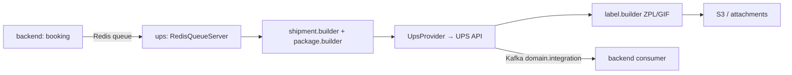

# UPS — Интеграция (отдельный микросервис)

**UPS** — интеграция с перевозчиком UPS. Как и [Brinks](brinks.md), вынесена в **отдельный репозиторий-микросервис** `workspaces/ups` (NestJS + Kue + Kafka), а не реализована внутри `backend`. Ранее имела только упоминания — заполняем пробел.

> Репозиторий: `workspaces/ups` (отдельный сервис).

---

## 1. Зачем (бизнес)

UPS — глобальный экспресс-перевозчик. Интеграция автоматизирует:
- **Создание отправки** (`createShipment`) в системе UPS при бронировании;
- **Генерацию этикеток** в разных форматах (ZPL, GIF) — для печати на складе;
- **Отслеживание** и приём событий;
- **Управление документами** (инвойсы, таможенные документы) с загрузкой в облако;
- **Периодические задачи** (cron) — в отличие от Brinks, у UPS есть планировщик.

---

## 2. Как устроено (код, file:line)

| Компонент | Файл | Назначение |
|-----------|------|-----------|
| Точка входа | `src/main.ts:28-36` | `RedisQueueServer` — слушает Redis-очередь от backend (идентично Brinks) |
| Label builder | `src/modules/ups/business-logic/builders/label.builder.ts:16-34` | формат этикетки (ZPL/GIF, по умолчанию 4×6) |
| Форматы печати | `src/modules/ups/business-logic/constants/labelPrintMethods.ts` | `LABEL_PRINT_METHODS` (ZPL / GIF / …) |
| Cron | `src/core/cron/cron.service.ts` | периодические задачи (опрос/синхронизация) |
| Builders | `src/modules/ups/business-logic/builders/*.builder.ts` | `shipment.builder`, `package.builder`, `customs.builder`, `attachDocument.builder`, `invoiceCharge.builder` |
| Провайдер | `src/modules/ups/business-logic/provider` | `UpsProvider` — вызовы UPS API |
| Форматтер полей | `src/lib/field-formatter/` | нормализация адресов и полей под требования UPS |
| Шифрование | `src/.../crypto` | шифрование учётных данных |

**Стек:** NestJS, Kue (Redis), KafkaJS (лог в `domain.integration`), репозитории `upsAccountsRepository` / `upsDocumentsRepository` / `upsShipmentsRepository`, S3/облако для вложений.

### Поток данных

---

## 3. Где найти и настроить

- **Активация:** `integration_settings` (`integration_name = 'ups'`) + `active_integrations` для пары shipper↔carrier (см. [setup-guide.md](../setup-guide.md)).
- **Учётные данные UPS** — в собственной БД сервиса (зашифрованы через crypto-модуль).
- **Формат этикетки** (ZPL/GIF, размер) — параметр в `labelPrintMethods`; по умолчанию ZPL 4×6.
- **Admin-App** → Active Integrations.

> 📷 Скриншоты UI — см. [SCREENSHOTS-TODO.md](../../SCREENSHOTS-TODO.md).

---

## 4. Сценарии

1. **Бронирование UPS.** Backend кладёт задачу в очередь → сервис строит отправку (`shipment.builder` + `package.builder`) → `UpsProvider` создаёт отправку в UPS → возвращается этикетка.
2. **Печать этикетки.** `label.builder` генерирует ZPL (термопринтер) или GIF (изображение); файл сохраняется как вложение в S3, ссылка — в отправке.
3. **Прикрепление документов.** Таможенные инвойсы формируются `attachDocument.builder` / `invoiceCharge.builder` и загружаются в облако.
4. **Периодическая синхронизация.** Cron (`cron.service.ts`) опрашивает статусы/выполняет регламентные задачи.

---

## Связанные документы

- [README.md](README.md) — все перевозчики
- [brinks.md](brinks.md) — Brinks (та же архитектура отдельного сервиса)
- [../../microservices/README.md](../../microservices/README.md) — карта микросервисов
- [../architecture/README.md](../architecture/README.md) — архитектура очередей

---

## 🔗 Граф-метаданные
- **id:** `integrations.carriers.ups`
- **type:** module-doc · **domain:** Integrations · **status:** implemented
- **confluence:** 629375144 · **repo:** `integrations/carriers/ups.md`
- **code_refs:** `ups/src/main.ts:28-36`, `ups/src/modules/ups/business-logic/builders/label.builder.ts:16-34`, `ups/src/modules/ups/business-logic/constants/labelPrintMethods.ts`, `ups/src/core/cron/cron.service.ts`
- **modules:** Integrations, Microservices
- **references:** integrations.carriers.brinks, microservices.overview, integrations.carriers (README)
- **requirements:** нет требований — реализовано как отдельный сервис (источник: код `workspaces/ups`)
