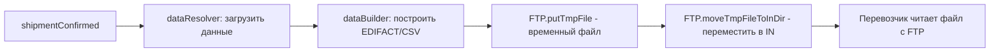
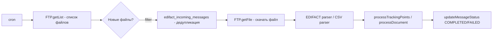
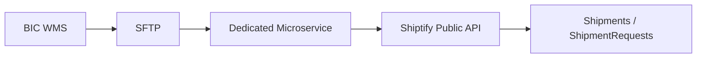

# EDI-интеграции

EDI (Electronic Data Interchange) — стандарт обмена бизнес-документами между системами. Shiptify использует EDI для интеграции с перевозчиками через FTP/SFTP по протоколам EDIFACT и CSV.

---

## Обзор EDI-интеграций

| Интеграция | Формат | Транспорт | Направление | Папка |
|-----------|--------|-----------|------------|-------|
| DB Schenker | EDIFACT (IFTMIN/IFTSTA) | FTP | Двунаправленная | `integration/db-schenker/` |
| Calvacom | EDIFACT (DISPOR/REPORT) | FTP | Двунаправленная | `integration/calvacom/` |
| Teliway | EDIFACT (DISPOR/REPORT) | FTP | Двунаправленная | `integration/teliway/` |
| Teliae | CSV | FTP | Двунаправленная | `integration/teliae/` |
| FedEx legacy | CSV | FTP | Входящая (трекинг) | `integration/fedex/` |
| Ecotransit | CSV / ZIP | FTP | Двунаправленная | `integration/ecotransit/` |
| BIC DESADV | EDIFACT (DESADV) | SFTP | Входящая | Отдельный микросервис |

---

## Общий FTP/EDIFACT паттерн

### Исходящий (Shiptify → Перевозчик)



### Входящий (Перевозчик → Shiptify)



### Дедупликация файлов

```sql
-- Таблица edifact_incoming_messages
-- Предотвращает повторную обработку одного файла
SELECT * FROM edifact_incoming_messages
WHERE file_name = 'IFTSTA_20260605_001.edi'
  AND integration = 'db_schenker';
-- Если запись есть → пропустить файл
```

---

## DB Schenker (EDIFACT IFTMIN/IFTSTA)

### Технические характеристики

- **Константа:** `INTEGRATION_TYPES.DB_SCHENKER = 'db_schenker'`
- **Папка:** `app/services/integration/db-schenker/`
- **Стандарт:** EDIFACT D96A (исходящий), EDIFACT D01B (входящий)

### Типы сообщений

| Тип | Направление | Стандарт | Описание |
|-----|------------|---------|---------|
| IFTMIN | Shiptify → Schenker | EDIFACT D96A | Инструкция по фрахту (бронирование) |
| IFTSTA | Schenker → Shiptify | EDIFACT D01B | Статус перевозки (трекинг) |

### Структура IFTMIN (бронирование)

```
UNA (Service string advice)
UNB (Interchange header)
UNH (Message header)
BGM (Beginning of message)
DTM (Date/time)
TSR (Transport service requirements)
NAD (Name and address) — отправитель, получатель
GID (Goods item details)
MEA (Measurements) — вес, объём
DIM (Dimensions)
UNT (Message trailer)
UNZ (Interchange trailer)
```

### Метаданные

Shiptify хранит HAWB и MAWB от DB Schenker:

```javascript
// После успешного бронирования
await storeIntegrationMetadata(shipmentId, 'db_schenker', {
    hawb: response.hawb,
    mawb: response.mawb
});
```

---

## Calvacom (EDIFACT DISPOR/REPORT)

### Технические характеристики

- **Папка:** `app/services/integration/calvacom/`
- **Специализация:** телематика / GPS-трекеры
- **Стандарт:** EDIFACT DISPOR / REPORT

### Типы сообщений

| Тип | Направление | Описание |
|-----|------------|---------|
| DISPOR | Shiptify → Calvacom | Заказ перевозки (dispatch order) |
| REPORT | Calvacom → Shiptify | Отчёт о трекинге (события) |
| POD | Calvacom → Shiptify | Подтверждение доставки (документ) |

### DISPOR — структура

DISPOR (Dispatch Order) содержит:
- Идентификаторы отправки
- Адреса пикапа и доставки
- Описание груза (тип, вес, количество единиц)
- Временные окна
- Специальные инструкции

---

## Teliway (EDIFACT DISPOR/REPORT)

### Технические характеристики

- **Папка:** `app/services/integration/teliway/`
- **Два окружения:** `teliway_urby`, `teliway_evol`
- **Структура:** аналогична Calvacom

### Окружения

| Окружение | Описание |
|----------|---------|
| `teliway_urby` | Урбанистические / городские перевозки |
| `teliway_evol` | Стандартные перевозки |

Каждое окружение — отдельные FTP-credentials и отдельный `integration_name` в `integration_settings`.

---

## Teliae (CSV / FTP)

### Технические характеристики

- **Константа:** `INTEGRATION_TYPES.TELIAE = 'teliae'`
- **Папка:** `app/services/integration/teliae/`
- **Формат:** CSV (не EDIFACT)

### Функции

| Функция | Файл | Направление |
|---------|------|------------|
| Бронирование | CSV → FTP `IN/` | Shiptify → Teliae |
| Трекинг | CSV ← FTP `OUT/` | Teliae → Shiptify |
| POD | CSV ← FTP `OUT/` | Teliae → Shiptify |
| Этикетка | ZPL ← FTP response | Teliae → Shiptify |

### Генерация этикеток (ZPL → PDF)

```javascript
// impl.js (упрощённо)
const zplLabel = await provider.fetchLabel(teliaeRef);

// Конвертация через Labelary API
const pdfBuffer = await labelaryProvider.convertZplToPdf(zplLabel);

// Сохранение
const s3Url = await uploadToS3(pdfBuffer, `label-${shipmentId}.pdf`);
await storeAttachment(shipmentId, s3Url, 'LABEL');
```

### Возвраты

Телиа обрабатывает возвраты через флаг `PICKUP_FLAG_RETURN` в CSV-файле бронирования.

---

## FedEx legacy (CSV / FTP)

### Технические характеристики

- **Константа:** `INTEGRATION_TYPES.FEDEX = 'teliae-fedex'`
- **Папка:** `app/services/integration/fedex/`

Важно: FedEx legacy использует **Teliae data** для связи отправки. Номер отправки ищется через `ShipmentIntegrationTeliaeData`, а не напрямую.

```javascript
// impl.js
const teliaeData = await ShipmentIntegrationTeliaeData.findOne({
    where: { tracking_number: csvRow.trackingNumber }
});
if (!teliaeData) return; // отправка не найдена через Teliae-связь

const shipmentId = teliaeData.shipment_id;
await processTrackingPoints(shipmentId, mappedPoints);
```

---

## Ecotransit (CSV / FTP / ZIP)

### Технические характеристики

- **Константа:** `INTEGRATION_TYPES.ECOTRANSIT = 'ecotransit'`
- **Папка:** `app/services/integration/ecotransit/`
- **Особенность:** батчевая очередь (не одиночные задачи)

### Исходящий (отправка данных)

CSV-файл с данными отправок:

```
shipment_id,origin_country,destination_country,transport_mode,weight_kg,volume_m3
1234,FR,DE,ROAD,500,2.5
1235,FR,GB,AIR,50,0.3
```

### Входящий (результаты CO₂)

ZIP-архив с CSV-результатами:

```
shipment_id,co2_kg,distance_km,transport_mode
1234,45.2,1200,ROAD
1235,123.8,450,AIR
```

---

## BIC DESADV — Отдельный микросервис

BIC DESADV реализован как **отдельный микросервис**, не входящий в основной backend.

### Архитектура



### Типы сообщений DESADV

| Сегмент | Содержимое |
|---------|-----------|
| HI | ID сообщения, отправитель, дата создания |
| TI | Референс, имя, адрес, тип (получатель) |
| OI | Номер заказа, delivery note, даты, GLN, статус |
| PL | Тип EXP/Палета/Картон, кол-во, размеры, SSCC |
| CI | EAN, кол-во, единица, вес, объём |

### Логика по transport code

| Transport Code | Действие |
|---------------|---------|
| B2B2C | `POST /shipments` с internal_ref = DN number |
| B2B + B2C | (1) `POST /shipments` HUB→клиент (B2C нога), (2) буферизация, (3) `POST /shipment-request` склад→HUB (shuttle нога) |

### Ретроконсолидация

После обработки всех DESADV контейнера — пересчёт и распределение стоимости:
- 4 DN по 99 кг → попадают в тариф `<100 кг`
- После консолидации: 396 кг / 4 паллеты → применяется пакетный тариф
- Стоимость распределяется пропорционально

Подробнее: [../bic-desadv/README.md](../bic-desadv/README.md)

---

## Общие утилиты EDI

### EDIFACT builder

```javascript
// common/edifact/builder.js (упрощённо)
const message = new EdifactBuilder()
    .segment('UNB', { sender, recipient, date })
    .segment('UNH', { messageRef, messageType })
    .segment('BGM', { documentType, documentNumber })
    // ...
    .build();
```

### FTP-клиент

```javascript
// common/providers/ftpProvider.js
const ftp = new FTPClient(config.ftp);
await ftp.connect();
await ftp.putTmpFile(localPath, remoteTmpPath);
await ftp.moveTmpFileToInDir(remoteTmpPath, remoteInPath);
await ftp.disconnect();
```

---

## Связанные документы

- [../bic-desadv/README.md](../bic-desadv/README.md) — BIC DESADV полная документация
- [../carriers/README.md](../carriers/README.md) — перевозчики
- [../architecture/README.md](../architecture/README.md) — архитектура

---

## 🔗 Граф-метаданные
- **id:** `integrations.edi`
- **type:** module-doc · **domain:** Integrations · **status:** implemented
- **confluence:** 632160354 · **repo:** `integrations/edi/README.md`
- **code_refs:** TODO (заполнить при углублении)
- **modules:** Integrations
- **references:** —
- **requirements:** см. чеклисты/RTM (source backfill — волна 7.2)

