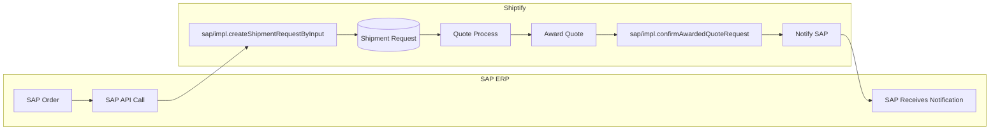
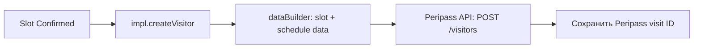
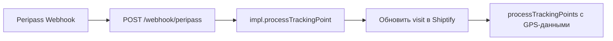

# ERP и бизнес-системы

Shiptify интегрируется с ERP-системами и внешними бизнес-платформами для синхронизации заказов, инвойсов, контактов и управления воротами склада.

---

## Обзор ERP-интеграций

| Система | Константа | Папка | Тип | Направление |
|---------|-----------|-------|-----|------------|
| SAP ERP | `sap` | `integration/sap/` | REST API | Двунаправленная |
| HubSpot CRM | _(нет константы)_ | `integration/hubspot/` | REST API v3 | Исходящая |
| Peripass (Gate) | `peripass` | `integration/peripass/` | REST API + webhook | Двунаправленная |
| Ecotransit (CO₂) | `ecotransit` | `integration/ecotransit/` | FTP / CSV | Двунаправленная |
| Reflex WMS | `reflex` | `integration/reflex/` | REST API | Исходящая |
| Public API | _(встроена)_ | _(REST endpoints)_ | REST API | Входящая |

---

## SAP ERP

SAP — самая сложная интеграция в системе. Полная двунаправленная синхронизация между SAP и Shiptify.

### Технические характеристики

- **Константа:** `INTEGRATION_TYPES.SAP = 'sap'`
- **Папка:** `app/services/integration/sap/`
- **Тип:** REST API (двунаправленная)
- **Авторизация:** ACL-система

### Архитектура SAP ↔ Shiptify



### Входящие операции от SAP

| Функция | Описание |
|---------|---------|
| `createShipmentRequestByInput` | SAP создаёт заявку на перевозку в Shiptify |
| `updateShipmentRequestByInput` | SAP обновляет существующую заявку |
| `deleteShipmentRequestById` | SAP отменяет / удаляет заявку |
| `updateShipmentByInput` | SAP обновляет данные отправки |

### Исходящие уведомления от Shiptify → SAP

| Функция | Триггер в Shiptify |
|---------|-------------------|
| `confirmAwardedQuoteRequest` | Пользователь подтверждает котировку |
| `notifyAwardedQuoteRequestConfirmed` | Quote Request подтверждён |
| `notifyQuoteRequestAwarded` | Quote Request получил предложение |
| `notifyShipmentRequestConfirmedOld` | Заявка подтверждена (legacy) |
| `notifyTrackingPointUpdated` | Новая точка трекинга |
| `notifyShipmentRequestDeclined` | Заявка отклонена |
| `notifyShipmentRequestCancelled` | Заявка отменена |

### Дополнительные SAP-функции

- **Transport plans** — синхронизация транспортных планов
- **Milkrun groups** — молочные рейсы (сборные маршруты)
- **Spectators / followers** — управление подписчиками уведомлений

### ACL-система

SAP использует систему управления доступом для авторизации запросов:

```javascript
// sap/impl.js
const isAuthorized = await aclService.checkSapAccess(
    requesterId,
    shipmentRequestId
);
if (!isAuthorized) throw new ForbiddenError('SAP ACL check failed');
```

---

## HubSpot CRM

### Технические характеристики

- **Папка:** `app/services/integration/hubspot/`
- **Тип:** REST API HubSpot v3
- **Триггеры:** события создания/обновления пользователей и аккаунтов

### Функции

| Функция | HubSpot API | Триггер |
|---------|------------|---------|
| Создание контакта | `POST /crm/v3/objects/contacts` | Новый пользователь |
| Обновление контакта | `PATCH /crm/v3/objects/contacts/{id}` | Обновление пользователя |
| Массовый upsert | `POST /crm/v3/objects/contacts/batch/upsert` | Batch-операции |

### Синхронизируемые данные

```javascript
// dataBuilder.js (упрощённо)
function buildHubSpotContact(user, account) {
    return {
        properties: {
            firstname: user.firstName,
            lastname: user.lastName,
            email: user.email,
            company: account.name,
            // доп. поля
        }
    };
}
```

---

## Peripass — Gate Management

Peripass — система управления въездом/выездом на склад.

### Технические характеристики

- **Константа:** `INTEGRATION_TYPES.PERIPASS = 'peripass'`
- **Папка:** `app/services/integration/peripass/`
- **Тип:** REST API (исходящий) + webhook (входящий)

### Исходящий поток (Shiptify → Peripass)



| Функция | Описание |
|---------|---------|
| `createVisitor` | Создание визита с данными слота и расписания |
| `updateVisitor` | Обновление визита при изменении данных |

### Входящий поток (Peripass → Shiptify)



Peripass отправляет события въезда/выезда грузовика, которые конвертируются в STY-события трекинга.

---

## Ecotransit — Расчёт CO₂

### Технические характеристики

- **Константа:** `INTEGRATION_TYPES.ECOTRANSIT = 'ecotransit'`
- **Папка:** `app/services/integration/ecotransit/`
- **Тип:** FTP / CSV (двунаправленный)
- **Обработка:** батчевая очередь

### Поток расчёта CO₂

```mermaid
graph LR
    A[Shipment Created] --> B[Добавить в очередь Ecotransit]
    B --> C[(Batch Queue)]
    C --> D[cron: отправить батч]
    D --> E[FTP: upload CSV с данными отправок]
    E --> F[Ecotransit processing...]
    F --> G[cron: опрос FTP]
    G --> H[Download ZIP с результатами]
    H --> I[parseResults]
    I --> J[Сохранить CO₂ amount + distance на Shipment]
```



### Данные, отправляемые в Ecotransit

- Маршрут (origin, destination)
- Режим перевозки (Air, Sea, Road)
- Вес и объём груза
- Тип транспорта (если известен)

### Данные из Ecotransit

- `co2_amount` — количество CO₂ в кг
- `distance_km` — расстояние в км
- Сохраняются на уровне Shipment в Shiptify

---

## Reflex WMS

### Технические характеристики

- **Константа:** `INTEGRATION_TYPES.REFLEX = 'reflex'`
- **Папка:** `app/services/integration/reflex/`
- **Тип:** вебхук (исходящий)
- **Направление:** только Shiptify → Reflex

### Поток

```
Shipment Created
    ↓
service.enqueueReflexWebhook(shipmentId)
    ↓
Worker: impl.sendShipmentToReflex(shipmentId)
    ↓
dataResolver загружает данные отправки
    ↓
dataBuilder строит Reflex-формат
    ↓
provider.POST(reflexEndpointUrl, payload)
```

### Данные, отправляемые в Reflex

Полные данные отправки: адреса, содержимое, даты, метаданные.

---

## Public API (входящая)

Shiptify предоставляет собственный REST API для входящих интеграций.

### Использование

| Интеграция | Как использует Public API |
|-----------|--------------------------|
| BIC DESADV | `POST /shipments` — создание отправок из DESADV |
| SAP | Часть уведомлений через API |
| Партнёры | Создание и обновление отправок |

### Основные эндпоинты

```
POST /api/v1/shipments                     ← создание отправки
POST /api/v1/shipment-requests             ← создание заявки
GET  /api/v1/shipments/{id}                ← получение отправки
PUT  /api/v1/shipments/{id}                ← обновление отправки
POST /api/v1/shipments/{id}/tracking       ← добавление трекинг-точки
```

### Аутентификация

- API Key (Bearer token)
- Per-account credentials

---

## Связанные документы

- [../carriers/README.md](../carriers/README.md) — перевозчики
- [../edi/README.md](../edi/README.md) — EDI и Ecotransit FTP
- [../webhooks/README.md](../webhooks/README.md) — вебхуки и события
- [../setup-guide.md](../setup-guide.md) — активация

---

## 🔗 Граф-метаданные
- **id:** `integrations.erp`
- **type:** module-doc · **domain:** Integrations · **status:** implemented
- **confluence:** 632651825 · **repo:** `integrations/erp/README.md`
- **code_refs:** TODO (заполнить при углублении)
- **modules:** Integrations
- **references:** —
- **requirements:** см. чеклисты/RTM (source backfill — волна 7.2)

