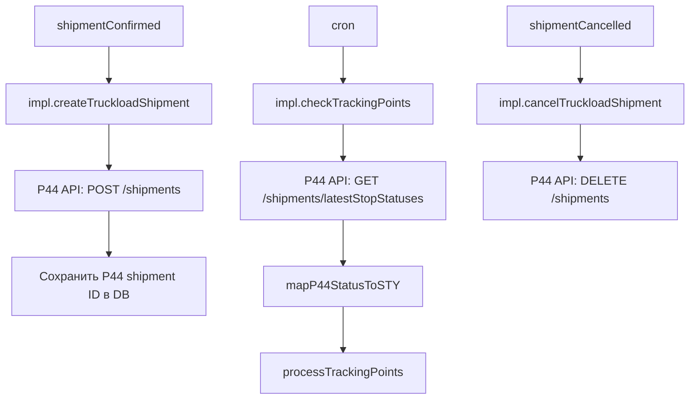
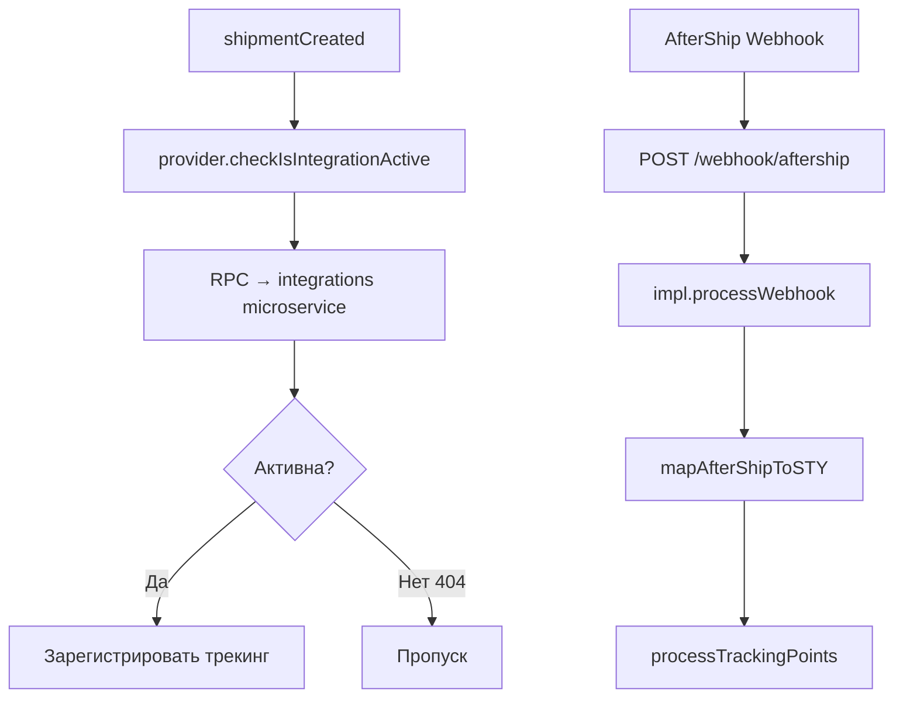

# Трекинговые платформы

Помимо прямых интеграций с перевозчиками, Shiptify подключается к трём агрегаторам трекинга и одному морскому трекинговому сервису. Эти платформы обеспечивают трекинг в реальном времени поверх множества перевозчиков.

---

## Обзор платформ

| Платформа | Константа | Папка | Тип | Перевозчиков | Особенности |
|-----------|-----------|-------|-----|-------------|------------|
| Project44 (P44) | `p44` | `integration/p44/` | REST + cron polling | 27+ | ETA, карта трекинга, TL |
| Shippeo | `shippeo` | `integration/shippeo/` | REST + webhook | ~50 | GPS real-time, Inovert transformer |
| AfterShip | `aftership` | `integration/aftership/` | RPC + webhook | 900+ | Уведомления клиентам, e-commerce |
| Marine Traffic (Kpler) | `marine_traffic_kpler` | `integration/marine-traffic/` | REST + cron | Морской | Vessel tracking, карта |

---

## Project44 (P44)

### Технические характеристики

- **Константа:** `INTEGRATION_TYPES.P44 = 'p44'`
- **Папка:** `app/services/integration/p44/`
- **Тип:** REST API + cron polling
- **Специализация:** Truckload (TL) перевозки

### Архитектура



### Функции

| Функция | P44 API endpoint | Триггер |
|---------|-----------------|---------|
| `createTruckloadShipment` | `POST /shipments` | shipmentConfirmed |
| `updateTruckloadShipment` | `PUT /shipments/{id}` | shipmentUpdated |
| `cancelTruckloadShipment` | `DELETE /shipments/{id}` | shipmentCancelled |
| Tracking polling | `GET /shipments/{id}/latestStopStatuses` | cron |

### STY-маппинг P44

| P44 статус | STY-код | Описание |
|-----------|---------|---------|
| `AT_PICKUP` | STY0000 | Прибытие на пикап |
| `DEPARTED_PICKUP` | STY0019 | Отправление с первой остановки |
| `IN_TRANSIT` | STY0050 | В пути |
| `ARRIVED_STOP` | STY0016 | Прибытие на остановку |
| `ARRIVED_DROPOFF` | STY9999 | Прибытие на выгрузку |
| `DELIVERED` | STY0507 | Доставлено |

### ETA (реальные даты прогноза)

P44 возвращает `liveReplanDates` — прогнозные ETA. Shiptify сохраняет их на отправке как `estimated_delivery_date`.

### Карта трекинга

P44 предоставляет URL для встроенной карты трекинга, который сохраняется как `tracking_link` на отправке:

```javascript
const trackingMapUrl = `https://visibility.project44.com/tracking/${p44ShipmentId}`;
await updateShipmentTrackingLink(shipmentId, trackingMapUrl);
```

### Конфигурация

Учётные данные per-shipper из конфигурации:

```javascript
// config.p44.API.shippers
{
    "42": {  // shipper_id
        "clientId": "...",
        "clientSecret": "...",
        "environment": "production"
    }
}
```

### Хранение данных

```sql
-- Таблица: shipment_integration_p44
SELECT * FROM shipment_integration_p44
WHERE shipment_id = 1234;
-- internal_shipment_id = 'p44-uuid-xxx'
-- tracking_number = 'P44TRK123'
```

---

## Shippeo

### Технические характеристики

- **Константа:** `INTEGRATION_TYPES.SHIPPEO = 'shippeo'`
- **Папка:** `app/services/integration/shippeo/`
- **Тип:** REST API (создание) + webhook (трекинг) + polling (резервный)
- **Трансформер трекинга:** использует `inovert` transformer

### Архитектура

```mermaid
graph TD
    A[shipmentConfirmed] --> B[impl.createShippeoShipment]
    B --> C[Shippeo API: POST /shipments]
    C --> D[Сохранить Shippeo ID в DB]

    E[Shippeo Webhook] --> F[POST /webhook/shippeo]
    F --> G[impl.processTrackingEvent]
    G --> H[inovert transformer → STY]
    H --> I[processTrackingPoints]

    J[cron] --> K[impl.pollShippeoStatus]
    K --> L[Shippeo API: GET /shipments/{id}/events]
```

### Функции

- Создание отправки на платформе Shippeo
- Приём webhook-событий от Shippeo
- Cron-опрос как резервный механизм
- Сохранение GPS-точек и статусов

### Конфигурация per-shipper

```javascript
// config.shippeo.API.shippers
{
    "42": {  // shipper_id
        "apiKey": "shippeo-api-key-xxx",
        "shipperId": "shippeo-shipper-id-yyy"
    }
}
```

### Обработка ошибок

Ошибки интеграции сохраняются через `active-integration-errors.js`:

```javascript
await saveActiveIntegrationError(activeIntegrationId, {
    errorType: 'SHIPMENT_CREATION_FAILED',
    message: error.message,
    payload: requestPayload
});
```

---

## AfterShip

### Технические характеристики

- **Константа:** `INTEGRATION_TYPES.AFTERSHIP = 'aftership'`
- **Папка:** `app/services/integration/aftership/`
- **Тип:** RPC к микросервису + webhook
- **Особенность:** проверяет активность интеграции через RPC (404 = нет)

### Архитектура



### RPC-проверка активности

```javascript
// provider.js
const result = await rpcFetch(`${RPC_AFTERSHIP_URL}/check-active`, {
    shipmentId,
    carrierId
});
// 404 → null → интеграция не активна, выходим
if (!result) return false;
```

### Webhook payload

```json
{
    "event": "tracking_updated",
    "msg": {
        "tracking_number": "1Z123456789",
        "carrier": "ups",
        "tag": "Delivered",
        "checkpoints": [
            {
                "tag": "Delivered",
                "message": "Package delivered",
                "location": "Paris, FR",
                "created_at": "2026-06-05T14:00:00Z"
            }
        ]
    }
}
```

---

## Marine Traffic (Kpler)

### Технические характеристики

- **Константа:** `INTEGRATION_TYPES.MARINE_TRAFFIC = 'marine_traffic_kpler'`
- **Папка:** `app/services/integration/marine-traffic/`
- **Тип:** REST API + cron polling
- **Специализация:** морские перевозки, vessel tracking

### Функции

| Функция | Описание |
|---------|---------|
| Обновление tracking requests | Регистрация отслеживания судна |
| Заполнение внешних ID отправки | `external_shipment_id` из Marine Traffic |
| Синхронизация трекинг-точек | Позиции судна → STY-события |
| Ссылка на карту трекинга | Публичная ссылка на карту Marine Traffic |

### Cron polling

```
cron → impl.updateTrackingPoints()
  → provider.getVesselPositions(imo, mmsi)
  → mapPositionsToTrackingPoints()
  → processTrackingPoints(shipmentId, points)
  → updateTrackingMapLink(shipmentId, mapUrl)
```

---

## Сравнение платформ

| Критерий | P44 | Shippeo | AfterShip | Marine Traffic |
|---------|-----|---------|-----------|---------------|
| Тип груза | Автодоставка | Авто / мульти | Универсальный | Морской |
| Охват перевозчиков | 27+ | ~50 | 900+ | Суда |
| GPS-трекинг | Нет | Да | Нет | Да |
| ETA-прогноз | Да | Да | Нет | Нет |
| Карта трекинга | Да | Нет | Нет | Да |
| Webhook | Нет | Да | Да | Нет |
| Polling | Да (cron) | Резервный | Нет | Да (cron) |

---

## Общий паттерн трекинга

Все трекинговые платформы используют единый внутренний интерфейс:

```javascript
// Все трансформеры → STY-коды
const trackingPoints = mapExternalStatusToSTY(externalEvents);

// Единый метод записи трекинга
await processTrackingPoints(shipmentId, trackingPoints);
// trackingPoints: [{ sty_code, date, location, description }]
```

---

## Связанные документы

- [../carriers/README.md](../carriers/README.md) — перевозчики
- [../architecture/README.md](../architecture/README.md) — архитектура
- [../setup-guide.md](../setup-guide.md) — активация

---

## 🔗 Граф-метаданные
- **id:** `integrations.tracking`
- **type:** module-doc · **domain:** Integrations · **status:** implemented
- **confluence:** 632979489 · **repo:** `integrations/tracking/README.md`
- **code_refs:** TODO (заполнить при углублении)
- **modules:** Integrations
- **references:** —
- **requirements:** см. чеклисты/RTM (source backfill — волна 7.2)

