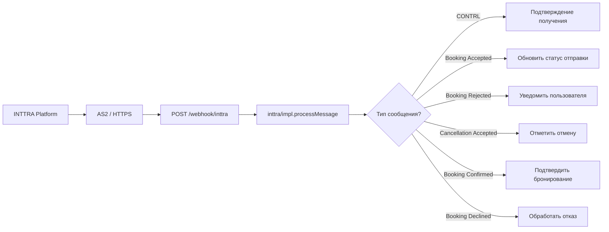
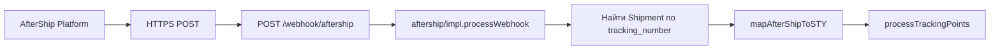
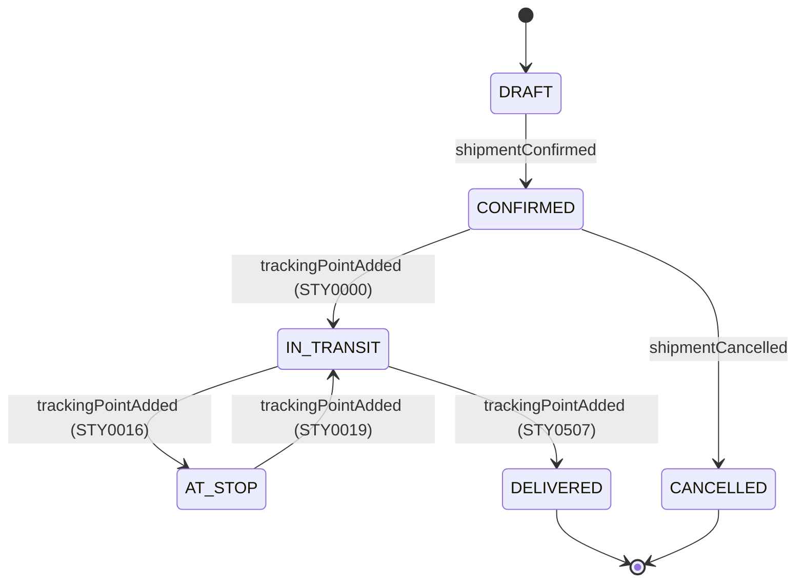

# Вебхуки и события

Shiptify поддерживает вебхуки в двух направлениях: входящие (внешние системы уведомляют Shiptify) и исходящие (Shiptify уведомляет внешние системы о событиях отправки).

---

## Обзор вебхуков

| Направление | Система | Эндпоинт / Метод | События |
|------------|---------|-----------------|---------|
| Входящий | INTTRA | `POST /webhook/inttra` | Booking accepted/rejected/confirmed |
| Входящий | AfterShip | `POST /webhook/aftership` | Tracking updates |
| Входящий | Peripass | `POST /webhook/peripass` | Gate events (въезд/выезд) |
| Входящий | SAP | `POST /api/sap/...` | Order sync, notifications |
| Исходящий | Reflex WMS | `POST {reflexUrl}` | Shipment created |
| Исходящий | Shippeo | `POST {shippeoUrl}/webhook` | Создание отправки |
| Исходящий | Public API | N/A | Shipment lifecycle events |

---

## Входящие вебхуки

### INTTRA (AS2 / XML)

INTTRA использует протокол AS2 для обмена EDI-сообщениями в XML-формате.

#### Архитектура



#### Типы XML-сообщений INTTRA

| Тип сообщения | Описание |
|--------------|---------|
| `CONTRL` | Технический: подтверждение получения EDI |
| `Booking Accepted` | Перевозчик принял бронирование |
| `Booking Rejected` | Перевозчик отклонил бронирование |
| `Cancellation Accepted` | Отмена принята |
| `Cancellation Rejected` | Отмена отклонена |
| `Booking Confirmation` | Подтверждение с деталями |
| `Booking Decline` | Окончательный отказ |

#### Структура XML-сообщения

```xml
<?xml version="1.0" encoding="UTF-8"?>
<BookingAccepted>
    <MessageHeader>
        <MessageId>MSG-12345</MessageId>
        <Sender>INTTRA</Sender>
        <Timestamp>2026-06-05T10:00:00Z</Timestamp>
    </MessageHeader>
    <BookingReference>
        <ShippingInstructionId>SI-67890</ShippingInstructionId>
        <CarrierReference>CAR-REF-001</CarrierReference>
    </BookingReference>
</BookingAccepted>
```

---

### AfterShip (JSON вебхук)

#### Архитектура



#### Payload вебхука

```json
{
    "event": "tracking_updated",
    "msg": {
        "id": "aftership-id-xxx",
        "tracking_number": "1Z123456789",
        "carrier": "ups",
        "tag": "Delivered",
        "subtag": "Delivered_001",
        "checkpoints": [
            {
                "tag": "Delivered",
                "subtag": "Delivered_001",
                "message": "Package delivered",
                "location": "Paris 75001, FR",
                "checkpoint_time": "2026-06-05T14:00:00+02:00",
                "coordinates": {
                    "lat": 48.8566,
                    "lng": 2.3522
                }
            }
        ]
    }
}
```

#### AfterShip tags → STY-коды

| AfterShip tag | STY-код | Значение |
|--------------|---------|---------|
| `Pending` | — | Ожидание |
| `InfoReceived` | STY0010 | Информация получена |
| `InTransit` | STY0050 | В пути |
| `OutForDelivery` | STY0400 | В доставке |
| `Delivered` | STY0507 | Доставлено |
| `FailedAttempt` | STY0508 | Неудачная попытка |
| `Exception` | STY0520 | Исключение |

---

### Peripass (JSON вебхук)

Gate management — события въезда и выезда грузовика.

#### Payload вебхука

```json
{
    "event_type": "VEHICLE_ARRIVED",
    "visit_id": "peripass-visit-123",
    "timestamp": "2026-06-05T08:00:00Z",
    "vehicle": {
        "plate": "AB-123-CD",
        "driver_name": "Jean Dupont"
    },
    "gate": "GATE_A",
    "slot": {
        "slot_id": "slot-456",
        "scheduled_at": "2026-06-05T08:00:00Z"
    }
}
```

#### Типы событий Peripass

| Event type | STY-код | Описание |
|-----------|---------|---------|
| `VEHICLE_ARRIVED` | STY0200 | Грузовик прибыл на склад |
| `VEHICLE_DEPARTED` | STY0300 | Грузовик покинул склад |
| `LOADING_STARTED` | STY0210 | Начало погрузки |
| `LOADING_COMPLETED` | STY0220 | Погрузка завершена |

---

## Исходящие вебхуки

### Reflex WMS

```javascript
// reflex/impl.js
async function sendShipmentToReflex(shipmentId) {
    const shipment = await dataResolver.getFullShipment(shipmentId);
    const payload = dataBuilder.buildReflexPayload(shipment);

    await provider.post(config.reflex.webhookUrl, payload, {
        headers: {
            'Authorization': `Bearer ${config.reflex.apiKey}`,
            'Content-Type': 'application/json'
        }
    });
}
```

#### Payload для Reflex

```json
{
    "shipment_id": "SHIPTIFY-1234",
    "reference": "REF-567",
    "status": "CONFIRMED",
    "origin": {
        "name": "Warehouse A",
        "address": "1 Rue de la Paix",
        "city": "Paris",
        "country": "FR",
        "postal_code": "75001"
    },
    "destination": { "..." : "..." },
    "packages": [
        {
            "type": "PALLET",
            "quantity": 2,
            "weight_kg": 500,
            "length_cm": 120,
            "width_cm": 80,
            "height_cm": 100
        }
    ],
    "pickup_date": "2026-06-06T09:00:00Z",
    "delivery_date": "2026-06-08T17:00:00Z"
}
```

---

## Жизненный цикл отправки и события

### Основные события Shiptify



### STY-коды и события трекинга

| STY-код | Событие | Описание |
|---------|---------|---------|
| STY0000 | Departure pickup | Забор груза выполнен |
| STY0010 | Info received | Информация получена от перевозчика |
| STY0016 | Arrival first stop | Прибытие на промежуточную остановку |
| STY0019 | Departure first stop | Отправление с промежуточной остановки |
| STY0050 | In transit | В пути |
| STY0100 | At depot | На складе / депо |
| STY0200 | Arrived at warehouse | Прибытие на склад |
| STY0300 | Departed warehouse | Отправление со склада |
| STY0400 | Out for delivery | В процессе доставки |
| STY0507 | Delivered | Доставлено |
| STY0508 | Delivery failed | Неудачная попытка доставки |
| STY0510 | Customs cleared | Таможня пройдена |
| STY0520 | Exception | Исключение / проблема |
| STY9999 | Arrival destination | Прибытие в пункт назначения |

---

## Вложения к отправке (upload_shipment_attachment)

Несколько интеграций сохраняют документы как вложения к отправке.

### Типы вложений

| Тип | Константа | Источник |
|-----|-----------|---------|
| Этикетка | `LABEL` | FedEx API, Teliae, UPS, MyDHL |
| POD | `POD` | DB Schenker, Heppner, Dachser, Brinks |
| Инвойс | `INVOICE` | Различные |
| Документ таможни | `CUSTOMS` | Различные |

### Паттерн сохранения вложений

```javascript
// common/helpers/attachmentHelper.js

// 1. Скачать документ от перевозчика
const documentBuffer = await provider.downloadDocument(reference);

// 2. Загрузить в S3
const s3Key = `shipments/${shipmentId}/attachments/${fileName}`;
const s3Url = await s3Service.upload(documentBuffer, s3Key);

// 3. Создать запись в БД
await ShipmentAttachment.create({
    shipment_id: shipmentId,
    document_type: 'POD',
    file_url: s3Url,
    file_name: fileName,
    source: 'integration_dachser'
});
```

---

## Безопасность вебхуков

### Верификация подписи

```javascript
// Пример верификации для AfterShip
const signature = req.headers['aftership-hmac-sha256'];
const expectedSignature = crypto
    .createHmac('sha256', config.aftership.webhookSecret)
    .update(rawBody)
    .digest('base64');

if (signature !== expectedSignature) {
    return res.status(401).json({ error: 'Invalid signature' });
}
```

### IP whitelisting

Для INTTRA (AS2) используется IP-фильтрация на уровне инфраструктуры.

---

## Связанные документы

- [../carriers/README.md](../carriers/README.md) — трекинг перевозчиков
- [../tracking/README.md](../tracking/README.md) — трекинговые платформы
- [../erp/README.md](../erp/README.md) — ERP-вебхуки (SAP, Reflex)
- [../edi/README.md](../edi/README.md) — INTTRA AS2/EDI

---

## 🔗 Граф-метаданные
- **id:** `integrations.webhooks`
- **type:** module-doc · **domain:** Integrations · **status:** implemented
- **confluence:** 631046198 · **repo:** `integrations/webhooks/README.md`
- **code_refs:** TODO (заполнить при углублении)
- **modules:** Integrations
- **references:** —
- **requirements:** см. чеклисты/RTM (source backfill — волна 7.2)

