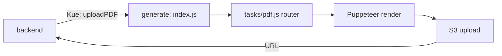

# Generate — Генерация документов/вложений (отдельный сервис)

**generate** (`workspaces/generate`, пакет `shiptify-attachments-generate`) — микросервис генерации PDF-документов и вложений: этикетки, CMR, манифесты, транспортные ордера, QR-коды. Использует **Puppeteer** для рендеринга и S3 для хранения. Ранее имел только упоминания — заполняем пробел.

> Репозиторий: `workspaces/generate`.

---

## 1. Зачем (бизнес)

Формирование печатных документов (этикетки паллет/слотов, CMR, манифесты групп, транспортные ордера, котировочные документы) вынесено в отдельный сервис, потому что Puppeteer-рендеринг ресурсоёмкий и должен выполняться асинхронно, не блокируя backend.

---

## 2. Как устроено (код, file:line)

| Компонент | Файл | Назначение |
|-----------|------|-----------|
| Точка входа | `src/index.js:1-49` | Kue listener на `QUEUE_NAMES.uploadPDF`, healthcheck |
| Роутер задач | `src/tasks/pdf.js:23-52` | маршрутизация на нужный генератор |
| Генераторы | `src/services/generate-pdf.js` | Puppeteer-рендеринг (см. ниже) |
| QR | `src/services/qr.js` | QR-коды (`qrcode-svg`) |
| S3 | `src/services/s3.js` | загрузка результата (`aws-sdk`) |

**Функции `generate-pdf.js`:** `buildSingleLabelPDF`, `buildLabelsPDF`, `buildBookingTransportOrderPDF`, `buildShipmentTransportOrderPDF`, `buildGroupManifestPDF`, `buildSlotLabelPDF`, `buildSingleCmrPDF`, `buildTrQuoteDocumentPDF`, `buildPDFFromRawHTML`.

### Поток

---

## 3. Где найти и настроить

- **Вызов:** backend кладёт задачу `uploadPDF` с параметрами (тип шаблона, данные отправки/слота/группы).
- **Хранилище:** результат — файл в S3, URL возвращается в callback.
- **Шаблоны:** HTML-шаблоны рендерятся Puppeteer; «сырой» HTML — через `buildPDFFromRawHTML`.

---

## 4. Сценарии

1. **Этикетка паллеты.** Backend запрашивает `buildSingleLabelPDF`/`buildLabelsPDF` → PDF → S3 → ссылка прикрепляется к отправке.
2. **CMR.** При бронировании автотранспорта — `buildSingleCmrPDF` формирует CMR-накладную.
3. **Манифест группы.** Для груп-отправки — `buildGroupManifestPDF`.
4. **Этикетка слота.** Для Slotify — `buildSlotLabelPDF` с QR-кодом визита.

---

## Связанные документы

- [README.md](README.md) — карта микросервисов
- [../tms/doc-center.md](../tms/doc-center/README.md) — Doc Center / вложения (если применимо)
- [core-libs.md](core-libs.md) — общие библиотеки

---

## 🔗 Граф-метаданные
- **id:** `microservices.attachments-generate`
- **type:** module-doc · **domain:** Microservices · **status:** implemented
- **confluence:** 629375161 · **repo:** `microservices/attachments-generate.md`
- **code_refs:** `generate/src/index.js:1-49`, `generate/src/tasks/pdf.js:23-52`, `generate/src/services/generate-pdf.js`, `generate/src/services/qr.js`
- **modules:** Microservices
- **references:** microservices.overview, microservices.core-libs
- **requirements:** нет требований — инфраструктурный сервис (источник: код `workspaces/generate`)
