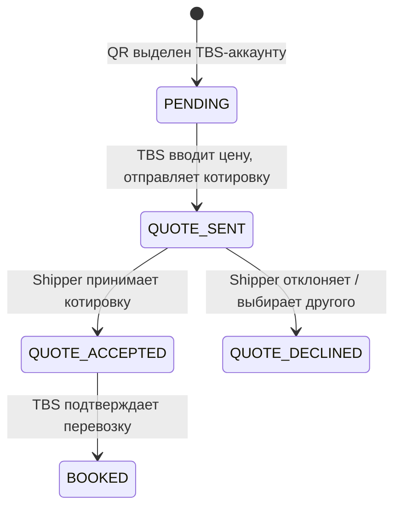

# Buy & Sell V3 — Автоматическое создание TR из QR

В **Buy & Sell V3** аккаунт типа TBS рассматривается одновременно как SHIPPER и SELLER. Когда QR направляется TBS-аккаунту, система автоматически создаёт TR (Transport Request) вместо стандартного QR.

> Источник: слайд `2026 02 - BUYSELL V3 _ TR_QR_TR`

---

## Полная цепочка объектов

```
Initial SR (запрос от 3PL Customer)
  └── QR ID (запрос котировок от Shipper)
        └── TR ID (авто-создаётся для TBS Seller)
              └── SR ID (заявка перевозчику от TBS)
                    └── SH ID (Shipment — выполненная перевозка)
```

---

## Жизненный цикл TR в этом флоу



---

## Ключевые правила

- TR создаётся в статусе **PENDING** при получении QR TBS-аккаунтом
- TBS вводит цену и отправляет котировку → исходный QR обновляется как "ответ получен" у Shipper
- При изменении цены после валидации и отправке → это модификация cost segment (dispute) → Shipper должен подтвердить
- Если используется PML (Planned Milestone) → **SLOT ID** остаётся одинаковым по всей цепочке субподряда
- На уровне TR при создании Shipment → первая и последняя точки отображаются через STY0000 / STY9999

---

## Каскадирование данных

Документы и метаданные (shared/requested) каскадируются по всей цепочке:
`SR → QR → TR → SR → SH`

---

## Сверено с кодом (2026-06-11) — статусы TR, 3PL, зеркалирование, маржа

### Статусы Transport Request (REQ-BS-005)

Enum `transport_requests.js:288-295`: **NEW → ACCEPTED / ASSIGNED / GROUPED / CANCELED / DECLINED**.

| Переход | Кто | Действие |
|---------|-----|----------|
| NEW → ASSIGNED / CANCELED | Покупатель | ACTION_BOOK / ACTION_CANCEL |
| NEW → DECLINED | Продавец | ACTION_DECLINE |
| DECLINED → NEW | Продавец | ACTION_REOPEN |
| GROUPED → ASSIGNED / CANCELED | — | из группы |

Матрица переходов: `services/transportRequests/constants.js:165-207`.

### Customer 3PL (REQ-BS-006)

- Клиент 3PL = **`partner_id`** на TR (ссылка на companies); domain type `'3pl'` (`models/domains.js:66`)
- Роли: `requester_account_id` (создал) / `buyer_account_id` (покупает) / `seller_account_id` (продаёт)
- Billing entities требуют 3PL customer (`services/accounting_entities.js`)

### Зеркалирование QR→TR (REQ-BS-007..008)

- Цепочка: **`TransportRequestRelation`** (parent_id ↔ child_id) + `original_transport_request_id`
- Синхронизируемые поля (GENERAL_TR_ATTRIBUTES, constants.js:52-93): аккаунты, mode, pre_shipment, адреса/зоны, даты shipping/arrival, объёмы (weight/volume/LM/CW), цены `requested_price`/`purchased_cost` + валюты, accounting_entity, partner

### Маржа BUY vs SELL

`buildMargin()` (`transportRequests/helper.js:163-187`): **маржа = requested_price (SELL) − purchased_cost (BUY)** → `{percent, gap}`. Детализация по строкам: `TransportRequestDetailedCost` (type: selling | purchase).

---

## 🔗 Граф-метаданные
- **id:** `tms.buy-sell.buysell-v3-qr-to-tr`
- **type:** module-doc · **domain:** TMS · **status:** implemented
- **confluence:** 632356881 · **repo:** `tms/buy-sell/buysell-v3-qr-to-tr.md`
- **code_refs:** TODO (заполнить при углублении)
- **modules:** TMS
- **references:** —
- **requirements:** см. чеклисты/RTM (source backfill — волна 7.2)

