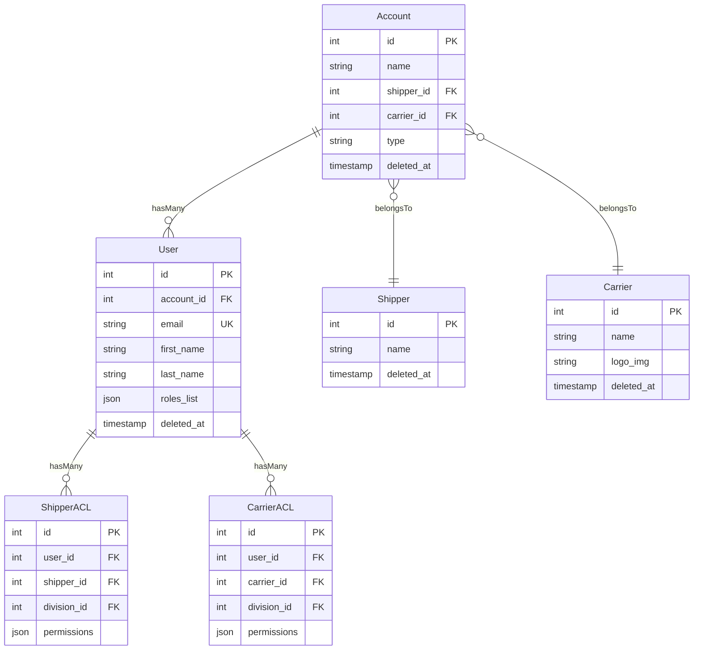
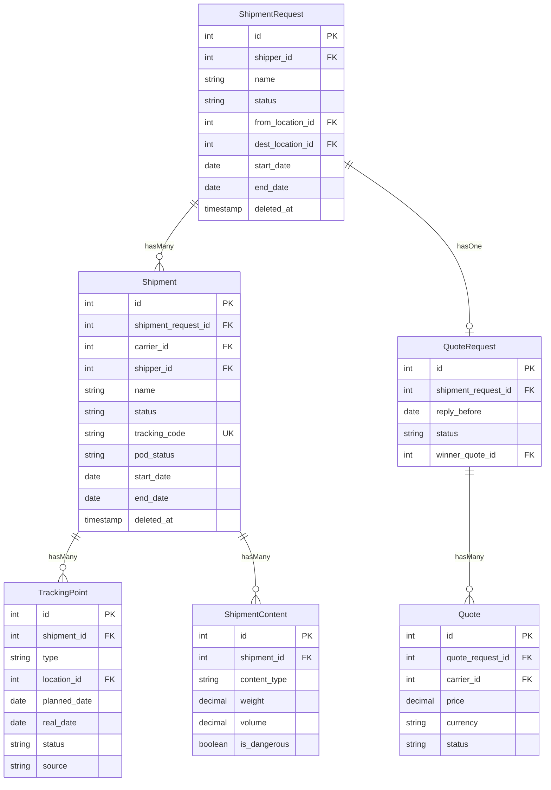
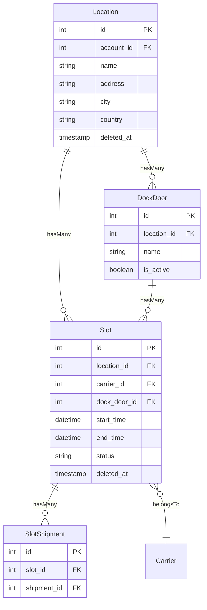
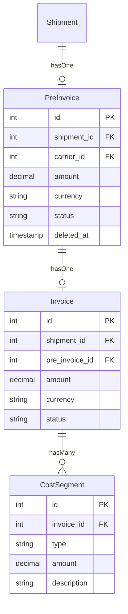
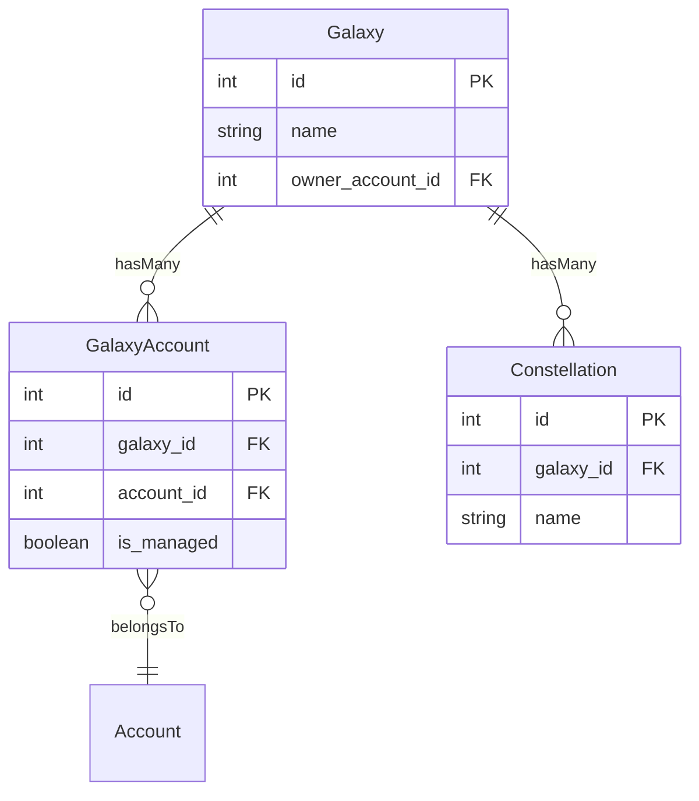

# ER-модель — Ключевые сущности

Диаграмма отображает основные модели TMS и связи между ними. Рендерится в GitLab автоматически.

## Ядро системы

## Перевозки (Core Flow)

## Слоты

## Инвойсинг

## Galaxy (Multi-tenant)

---

## 🔗 Граф-метаданные
- **id:** `tms.implementation.database.er-model`
- **type:** module-doc · **domain:** TMS · **status:** implemented
- **confluence:** 632684662 · **repo:** `tms/implementation/database/er-model.md`
- **code_refs:** TODO (заполнить при углублении)
- **modules:** TMS
- **references:** —
- **requirements:** см. чеклисты/RTM (source backfill — волна 7.2)

