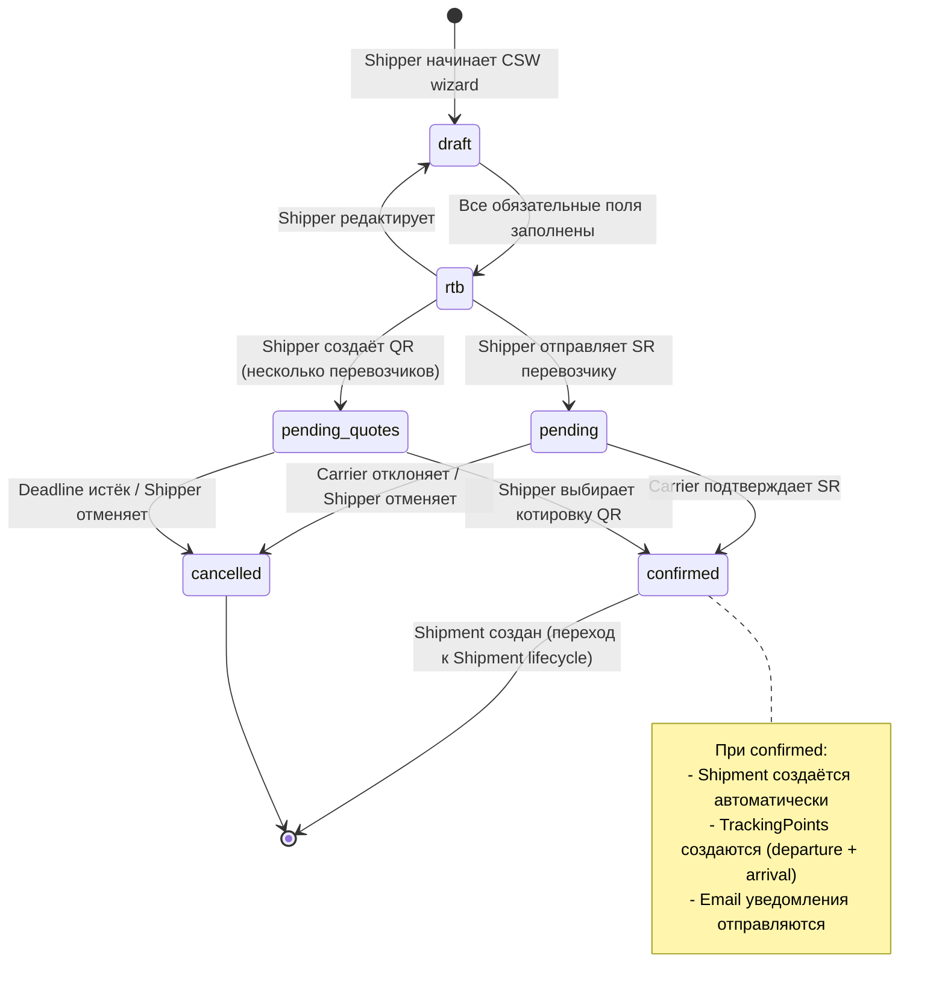
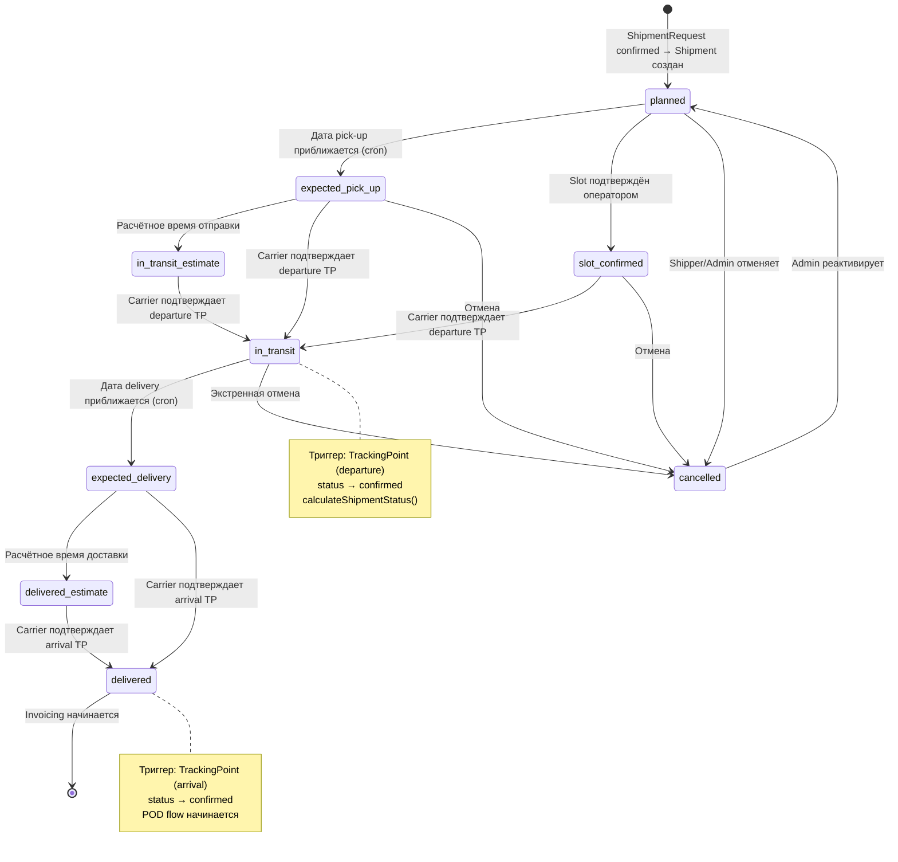
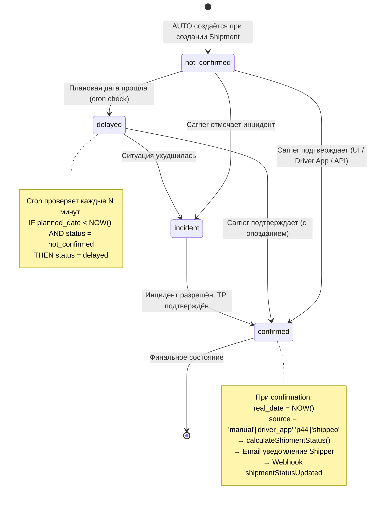
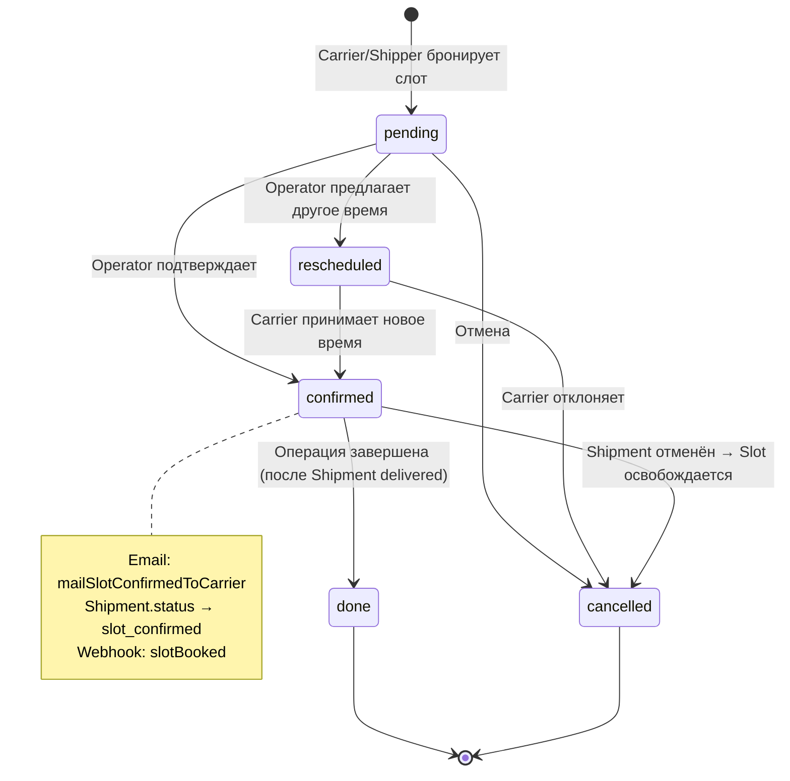
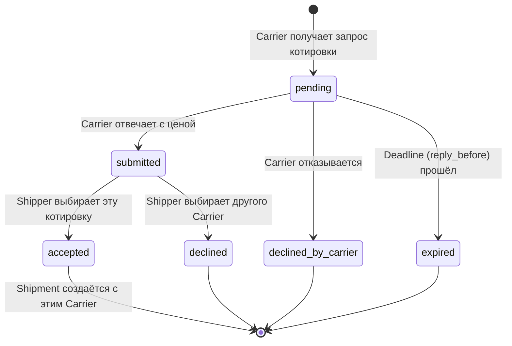
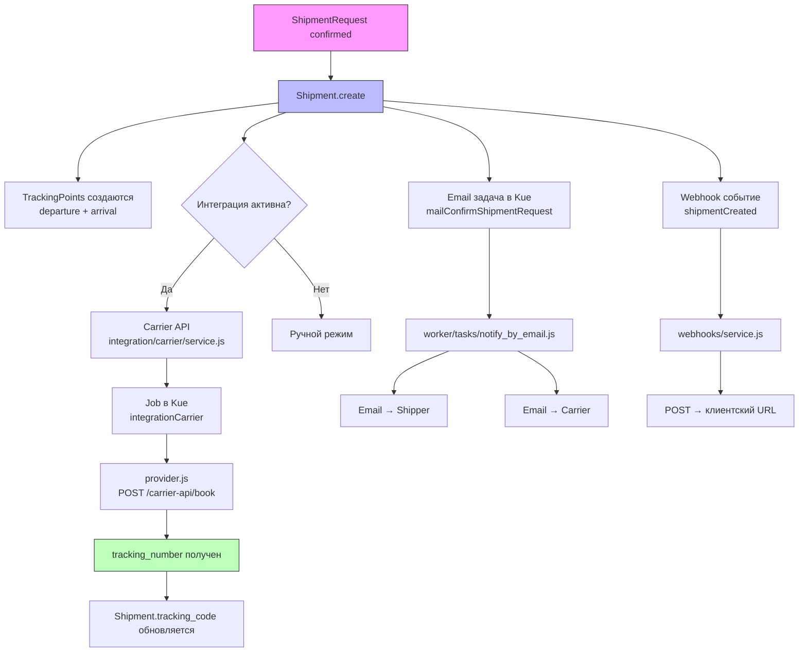
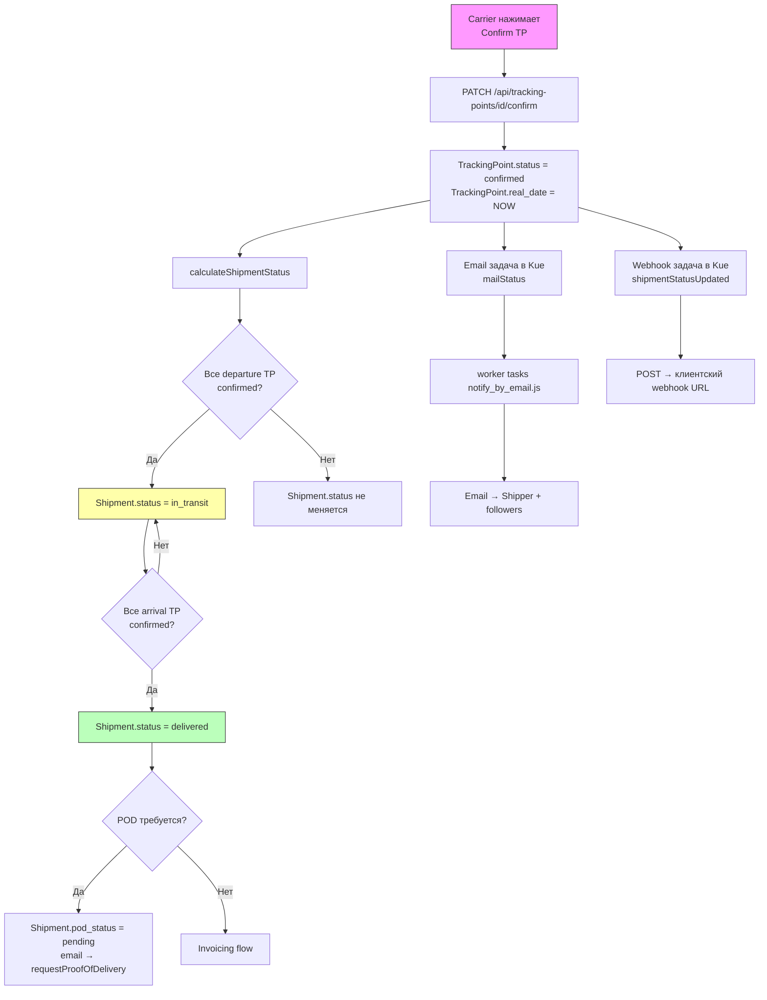
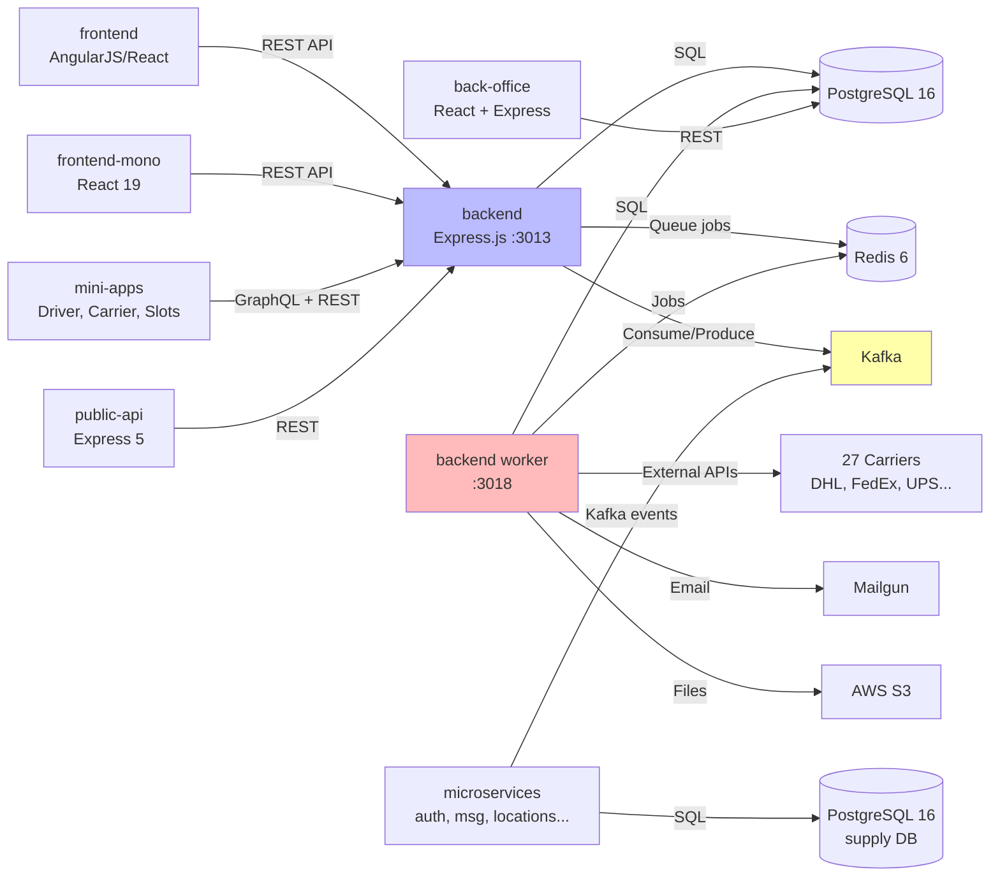

# Диаграммы жизненного цикла моделей

Показывают как модели меняют состояние, какие события их триггерят, и как изменение одной модели затрагивает другие.

---

## 1. Жизненный цикл ShipmentRequest → Shipment

---

## 2. Жизненный цикл Shipment

---

## 3. Жизненный цикл TrackingPoint

---

## 4. Жизненный цикл Slot

---

## 5. Жизненный цикл Quote (QR Flow)

---

## 6. Межсистемный Impact: создание Shipment

Что происходит в других частях системы при создании Shipment:

---

## 7. Межсистемный Impact: подтверждение TrackingPoint

---

## 8. Зависимости между репозиториями

---

## 🔗 Граф-метаданные
- **id:** `tms.implementation.database.lifecycle-diagrams`
- **type:** module-doc · **domain:** TMS · **status:** implemented
- **confluence:** 632619057 · **repo:** `tms/implementation/database/lifecycle-diagrams.md`
- **code_refs:** TODO (заполнить при углублении)
- **modules:** TMS
- **references:** —
- **requirements:** см. чеклисты/RTM (source backfill — волна 7.2)

