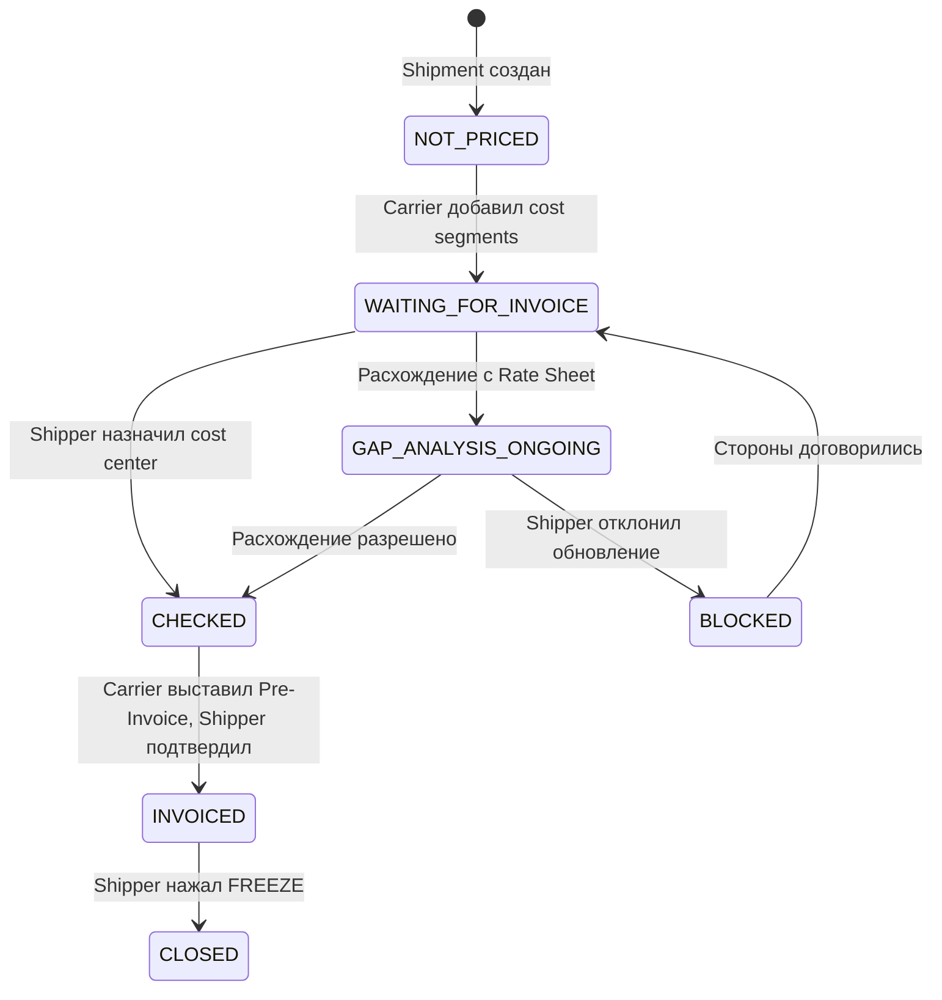

# Статусы инвойсинга — полное описание

Инвойсинговый статус показывает состояние финансового цикла по перевозке. Независим от статуса трекинга.

## Все статусы и условия

### 1. NOT PRICED ⚫

**Условие:** Стоимость не указана (ни до, ни после подтверждения SR).

```
SR создан, стоимость не добавлена
→ Invoicing status: NOT PRICED
```

---

### 2. WAITING FOR INVOICE 🔵

**Условие:** Стоимость указана в блоке "Detailed Costs" (Cost Segments).

```
Carrier добавил cost segments к перевозке
→ Invoicing status: WAITING FOR INVOICE
```

Означает: стоимость есть, но Pre-Invoice ещё не выставлен.

---

### 3. GAP ANALYSIS ONGOING 🟡

**Условие:** Стоимость в "Detailed Cost" не соответствует ожидаемому тарифу.

```
Cost segments ≠ Rate Sheet ожидаемая стоимость
→ Invoicing status: GAP ANALYSIS ONGOING
```

Shipper или AM должен разобраться с расхождением.

---

### 4. BLOCKED 🔴

**Условие:** Shipper отклонил запрошенное Carrier обновление стоимости.

```
Carrier запросил изменение cost
Shipper нажал "Refuse"
→ Invoicing status: BLOCKED
```

Требует ручного разрешения между сторонами.

---

### 5. CHECKED ✅

**Условие:** Shipper выбрал вариант в блоке "Assign accounting cost to:".

```
Shipper назначил стоимость на нужный cost center
→ Invoicing status: CHECKED
```

Промежуточный статус перед финальным Invoice.

---

### 6. INVOICED 🟢

**Условие:** Стоимость указана и подтверждена Shipper.

```
Carrier выставил Pre-Invoice
Shipper проверил и подтвердил
→ Invoicing status: INVOICED
```

---

### 7. CLOSED 🔒

**Условие:** Shipper нажал кнопку [FREEZE] в центральном блоке инвойсинга.

```
Invoice утверждён → Shipper нажимает FREEZE
→ Invoicing status: CLOSED
```

После CLOSED изменения невозможны. Экспорт в SAP/ERP происходит при этом статусе.

---

## Диаграмма переходов



## Связь с бэкендом

- Модель: `Shipment.invoicing_status` (enum)
- Pre-Invoice: модель `PreInvoice` → связана с Shipment
- Invoice: модель `Invoice` → создаётся из PreInvoice при подтверждении
- Worker: задача при переходе в INVOICED → уведомление Carrier

## Источник данных

Данные взяты из тест-сьюта "Invoicing statuses" (TC-2946 — TC-2952).

---

## Сверено с кодом (2026-06-11) — статусы Invoice, FREEZE, SAP (REQ-INV-009..016)

### Статусы Invoice

Enum `models/invoices.js:87-93`: **NEW, CHECKED, VALIDATED, BLOCKED, CANCELLED**. Отдельной state-machine нет — корректность переходов проверяет `isValidInvoiceSetNewStatus()` при update; действия: validate / check / block / unblock / cancel (`services/invoices/helper.js`).

### FREEZE после VALIDATED

Реализован **проверками статуса**, а не флагом:
- строки нельзя добавлять/снимать (`assignInvoicings()`, `invoices/index.js:677` — «Cannot change lines in validated invoice»)
- payment terms нельзя менять (`updateInvoicePaymentTermInTransaction()`, :711)

### SAP-экспорт при VALIDATED

**Не реализован.** На VALIDATED триггерится только generic-вебхук `webhookValidateInvoice()` (`invoices/index.js:421`). SAP-интеграция работает лишь с ShipmentRequest (создание/отмена/tracking) — invoice-обработчиков в `integration/sap/` нет. «Экспорт в SAP после FREEZE» из слайдов Invoicing V2 — планируемая функциональность.

---

## 🔗 Граф-метаданные
- **id:** `tms.invoicing.02_invoicing-statuses-detail`
- **type:** module-doc · **domain:** TMS · **status:** implemented
- **confluence:** 633045041 · **repo:** `tms/invoicing/02_invoicing-statuses-detail.md`
- **code_refs:** TODO (заполнить при углублении)
- **modules:** TMS
- **references:** —
- **requirements:** см. чеклисты/RTM (source backfill — волна 7.2)

