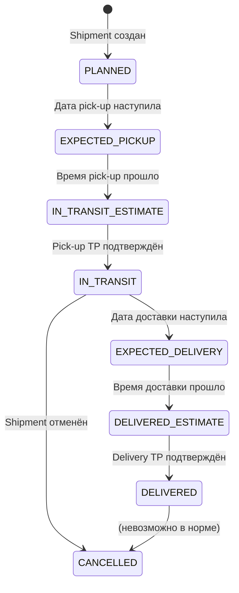

# Статусы трекинга — полное описание

Каждая перевозка имеет один из следующих статусов трекинга. Статус определяется автоматически на основе дат и подтверждённых TrackingPoints.

## Все статусы и условия

### 1. PLANNED 🔵

**Условие:** Дата и время pick-up ещё не наступили.

```
Shipment создан, дата pick-up = завтра
→ Статус: PLANNED
```

Отображается с прогресс-баром (сколько осталось до pick-up).

---

### 2. EXPECTED PICK-UP 🟡

**Условие:** Дата и время pick-up наступили, информация о pick-up запрошена у соответствующего источника (P44, Shippeo), но pick-up ещё не подтверждён.

```
Дата pick-up = сегодня, время pick-up прошло
Водитель ещё не подтвердил
→ Статус: EXPECTED PICK-UP
```

---

### 3. IN TRANSIT (ESTIMATE) 🟡

**Условие:** Дата и время pick-up наступили, pick-up ещё не подтверждён.

```
Дата pick-up прошла
TrackingPoint "pick-up" НЕ подтверждён
→ Статус: IN TRANSIT (ESTIMATE)
```

Показывает "On time" или "+N дней опоздание".

---

### 4. IN TRANSIT 🟠

**Условие:** TrackingPoint "pick-up" подтверждён.

```
Водитель/Система подтвердила pick-up
→ Статус: IN TRANSIT
  + "On time" или "+N дней late"
```

Это основной статус "груз в дороге".

---

### 5. EXPECTED DELIVERY 🟡

**Условие:** Дата и время доставки наступили, delivery запрошена у трекингового источника, но не подтверждена.

---

### 6. DELIVERED (ESTIMATE) 🟡

**Условие:** Дата и время доставки наступили, delivery не подтверждена.

```
Дата доставки прошла
TrackingPoint "delivery" НЕ подтверждён
→ Статус: DELIVERED (ESTIMATE)
```

---

### 7. DELIVERED 🟢

**Условие:** TrackingPoint "delivery" подтверждён.

```
Водитель подтвердил доставку
→ Статус: DELIVERED
  + "On time" или "+N дней late"
```

---

### 8. CANCELLED ⚫

**Условие:** Перевозка была подтверждена и затем отменена.

```
Shipment status → Cancelled
→ Статус трекинга: CANCELLED
```

Иконка и текст отличаются от других статусов (см. скриншоты).

---

### 9. SLOT CONFIRMED 🔵

**Условие:** Slot booking был подтверждён (отдельный статус для перевозок со слотами).

```
Carrier забронировал слот в Slotify
→ Статус: SLOT CONFIRMED
```

Отображается параллельно с основным статусом трекинга.

---

## Связь статусов трекинга и инвойсинга

| Трекинг статус | Инвойсинг доступен |
|---------------|-------------------|
| PLANNED | ❌ |
| IN TRANSIT | ❌ |
| DELIVERED | ✅ (Carrier может создать Pre-Invoice) |
| CANCELLED | ❌ |

## Как статус обновляется



## Источник данных (тест-кейсы)

Данные взяты из тест-сьюта "Tracking statuses" (TC-2937 — TC-2945), который является авторитетным описанием поведения системы.

---

## 🔗 Граф-метаданные
- **id:** `tms.tracking.02_tracking-statuses-detail`
- **type:** module-doc · **domain:** TMS · **status:** implemented
- **confluence:** 631046279 · **repo:** `tms/tracking/02_tracking-statuses-detail.md`
- **code_refs:** TODO (заполнить при углублении)
- **modules:** TMS
- **references:** —
- **requirements:** см. чеклисты/RTM (source backfill — волна 7.2)

